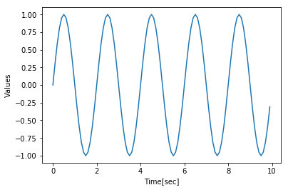
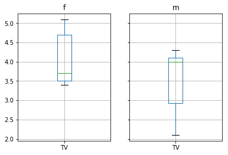
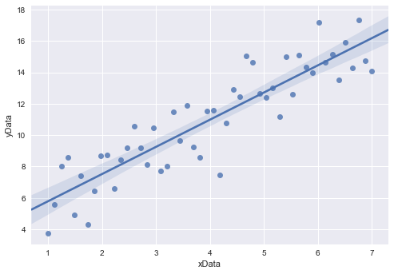

# 2 Python
<!-- toc orderedList:0 depthFrom:1 depthTo:6 -->

* [2 Python](#2-python)
  * [2.1 Getting Started](#21-getting-started)
    * [2.1.1 Conventions](#211-conventions)
    * [2.1.2 Distributions and Packages](#212-distributions-and-packages)
    * [2.1.3 Installation of Python](#213-installation-of-python)
    * [2.1.4 Installation of R and rpy2](#214-installation-of-r-and-rpy2)
    * [2.1.5 Personalizing IPython/Jupyter](#215-personalizing-ipythonjupyter)
    * [2.1.6 Python Resources](#216-python-resources)
    * [2.1.7 First Python Programs](#217-first-python-programs)
  * [2.2 Python Data Structures](#22-python-data-structures)
    * [2.2.1 Python Datatypes](#221-python-datatypes)
    * [2.2.2 Indexing and Slicing](#222-indexing-and-slicing)
    * [2.2.3 Vectors and Arrays](#223-vectors-and-arrays)
  * [2.3 IPython/Jupyter: An Interactive Programming Environment](#23-ipythonjupyter-an-interactive-programming-environment)
    * [2.3.1 First Session with the Qt Console](#231-first-session-with-the-qt-console)
    * [2.3.2 Notebook and rpy2](#232-notebook-and-rpy2)
    * [2.3.3 IPython Tips](#233-ipython-tips)
  * [2.4 Developing Python Programs](#24-developing-python-programs)
    * [2.4.1 Converting Interactive Commands into a Python Program](#241-converting-interactive-commands-into-a-python-program)
    * [2.4.2 Functions, Modules, and Packages](#242-functions-modules-and-packages)
    * [2.4.3 Python Tips](#243-python-tips)
    * [2.4.4 Code Versioning](#244-code-versioning)
  * [2.5 Pandas: Data Structures for Statistics](#25-pandas-data-structures-for-statistics)
    * [2.5.1 Data Handling](#251-data-handling)
    * [2.5.2 Grouping](#252-grouping)
  * [2.6 Statsmodels: Tools for Statistical Modeling](#26-statsmodels-tools-for-statistical-modeling)
  * [2.7 Seaborn: Data Visualization](#27-seaborn-data-visualization)
  * [2.8 General Routines](#28-general-routines)
  * [2.9 Exercises](#29-exercises)

<!-- tocstop -->


## 2.1 Getting Started

Python is a very popular open source programming language.
At the time of writing, codeeval was rating Python “the most popular language” for the fourth year in a row (http://blog.codeeval.com/codeevalblog).
There are three reasons why I have switched from other programming languages to Python:
1. It is the most elegant programming language that I know.
2. It is free.
3. It is powerful.


### 2.1.1 Conventions

### 2.1.2 Distributions and Packages
  * a) Python Packages for Statistics
  * b) PyPI: The Python Package Index

### 2.1.3 Installation of Python
  * a) Under Windows
  * b) Under Linux
  * c) Under Mac OS X

### 2.1.4 Installation of R and rpy2
  * a) Under Windows
  * b) Under Linux

### 2.1.5 Personalizing IPython/Jupyter
  * a) In Windows
  * b) In Linux
  * c) In Mac OS X

### 2.1.6 Python Resources

If you have some programming experience, this book may be all you need to get the statistical analysis of your data going.
But if required, very good additional information can be found on the web, where tutorials as well as good free books are available online.
The following links are all recommendable sources of information if you are starting with Python:

• Python Scientific Lecture Notes If you don’t read anything else, read this! (http://scipy-lectures.github.com)
• NumPy for Matlab Users Start here if you have Matlab experience. (https://docs.scipy.org/doc/numpy-dev/user/numpy-for-matlab-users.html; also check http://mathesaurus.sourceforge.net/matlab-numpy.html)
• Lectures on scientific computing with Python Great Jupyter Notebooks, from JR Johansson! (https://github.com/jrjohansson/scientific-python-lectures)
• The Python tutorial The official introduction. (http://docs.python.org/3/tutorial)

In addition free Python books are available, for different levels of programming skills:
• A Byte of Python A very good book, at the introductory level. (http://swaroopch.com/notes/python)
• Learn Python the Hard Way (3rd Ed) A popular book that you can work through. (http://learnpythonthehardway.org/book/)
• Think Python For advanced programmers. (http://www.greenteapress.com/thinkpython)
• Introduction to Python for Econometrics, Statistics and Data Analysis Introduces Python with a focus on statistics (Sheppard 2015).
• Probabilistic Programming and Bayesian Methods for Hackers An excellent introduction into Bayesian thinking. The section on Bayesian statistics in this book is also based on that book (Pilon 2015).

I have not seen many textbooks on Python that I have really liked.
My favorite introductory books are Harms and McDonald (2010), and the more recent Scopatz and Huff (2015).

When I run into a problem while developing a new piece of code, most of the time I just google; thereby I stick primarily (a) to the official Python documentation pages, and (b) to http://stackoverflow.com/.
Also, I have found user groups surprisingly active and helpful!


### 2.1.7 First Python Programs
  * a) Hello World


```python
print('Hello World')
```

    Hello World


  * b) SquareMe


```python
# %load ch02/squareMe.py
# This file shows the square of the numbers from 0 to 5.

def squared(x):
    return x**2

for ii in range(6):
    print(ii, squared(ii))

print('Done')

```

    0 0
    1 1
    2 4
    3 9
    4 16
    5 25
    Done


## 2.2 Python Data Structures

### 2.2.1 Python Datatypes

### 2.2.2 Indexing and Slicing

### 2.2.3 Vectors and Arrays

## 2.3 IPython/Jupyter: An Interactive Programming Environment

IPython uses Jupyter to provide different interface options, my favorite being the qtconsole:
```
jupyter qtconsole
```

A very helpful addition is the browser-based notebook, with support for code, text, mathematical expressions, inline plots and other rich media.
```
jupyter notebook
```

Note that many of the examples that come with this book are also available as Jupyter Notebooks, which are available at github: https://github.com/thomas-haslwanter/statsintro_python.git.

### 2.3.1 First Session with the Qt Console

### 2.3.2 Notebook and rpy2

  * a) The Notebook
  * b) rpy2

### 2.3.3 IPython Tips

## 2.4 Developing Python Programs

### 2.4.1 Converting Interactive Commands into a Python Program


```python
# %load ch02/L2_4_pythonScript.py
'''
Short demonstration of a Python script.

author: Thomas Haslwanter
date:   May-2015
ver:    1.0
'''

# Import standard packages
import numpy as np
import matplotlib.pyplot as plt

# Generate the time-values
t = np.r_[0:10:0.1]

# Set the frequency, and calculate the sine-value
freq = 0.5
x = np.sin(2*np.pi*freq*t)

# Plot the data
plt.plot(t,x)

# Format the plot
plt.xlabel('Time[sec]')
plt.ylabel('Values')

# Generate a figure, one directory up
plt.savefig(r'..\Sinewave.png', dpi=200)

# Put it on the screen
plt.show()

```





### 2.4.2 Functions, Modules, and Packages

  * a) Functions


```python
# %load ch02/L2_4_pythonFunction.py
'''Demonstration of a Python Function

author: thomas haslwanter, date: May-2015
'''

# Import standard packages
import numpy as np

def incomeAndExpenses(data):
    '''Find the sum of the positive numbers, and the sum of the negative ones.'''
    income = np.sum(data[data>0])
    expenses = np.sum(data[data<0])

    return (income, expenses)

if __name__=='__main__':
    testData = np.array([-5, 12, 3, -6, -4, 8])

    # If only real banks would be so nice ;)
    if testData[0] < 0:
        print('Your first transaction was a loss, and will be dropped.')
        testData = np.delete(testData, 0)
    else:
        print('Congratulations: Your first transaction was a gain!')

    (myIncome, myExpenses) = incomeAndExpenses(testData)
    print('You have earned {0:5.2f} EUR, and spent {1:5.2f} EUR.'.format(myIncome, -myExpenses))


```

    Your first transaction was a loss, and will be dropped.
    You have earned 23.00 EUR, and spent 10.00 EUR.


  * b) Modules


```python
# %load ch02/L2_4_pythonImport.py
'''Demonstration of importing a Python module

author: ThH, date: May-2015'''

# Import standard packages
import numpy as np

# additional packages: this imports the function defined above
import L2_4_pythonFunction

# Generate test-data
testData = np.arange(-5, 10)

# Use a function from the imported module
out = L2_4_pythonFunction.incomeAndExpenses(testData)

# Show some results
print('You have earned {0:5.2f} EUR, and spent {1:5.2f} EUR.'.format(out[0], -out[1]))

```

### 2.4.3 Python Tips

1. Stick to the standard conventions.
* Every function should have a documentation string on the line below the function definition.
* Packages should be imported with their commonly used names:
```
import numpy as np
import matplotlib.pyplot as plt
import scipy as sp
import pandas as pd
import seaborn as sns
```
2. To get the current directory, use os.path.abspath(os.curdir). And in Python modules a change of directories can NOT be executed with cd (as in IPython), but instead requires the command os.chdir(...).
3. Everything in Python is an object: to find out about ```"obj"```, use ```type(obj)``` and  ```dir(obj)```.
4. Learn to use the debugger. Personally, I always use the debugger from the IDE, and rarely resort to the built-in debugger pdb.
5. Know lists, tuples, and dictionaries; also, know about numpy arrays and pandas DataFrames.
6. Use functions a lot, and understand the ```if  __name__ == '__main__':``` construct.
7. If you have all your personal functions in the directory mydir, you can add this directory to your PYTHONPATH with the command ```import sys sys.path.append('mydir')```
8. If you are using non-ASCII characters, such as the German ```\"{o}\"{a}\"{u}{\ss}``` or the French ```\`{e}\'{e}```, you have to let Python know, by adding
```
# -*- coding: utf-8 -*-
```
in the first or second line of your Python module. This has to be done, even if the non-ASCII characters only appear in the comments! This requirement arises from the fact that Python will default to ASCII as standard encoding if no other encoding hints are given.


### 2.4.4 Code Versioning


Computer programs rarely come out perfect at the first try.
Typically they are developed iteratively, by successively eliminating the known errors.
Version control programs, also known as revision control programs, allow tracking only the modifications, and storing previous versions of the program under development.
If the latest changes cause a new problem, it is then easy to compare them to earlier versions, and to restore the program to a previous state.

I have been working with a number of version control programs, and git is the first one I am really happy with.
git is a version control program, and github is a central source code repository.
If you are developing computer software, I strongly recommend the use of git.
It can be used locally, with very little overhead.
And it can also be used to maintain and manage a remote backup copy of the programs.
While the real power of git lies in its features for collaboration, I have been very happy with it for my own data and software.
An introduction to git goes beyond the scope of this book, but a very good instruction is available under https://git-scm.com/.
Good, short, and simple starting instructions—in many languages—can be found at http://rogerdudler.github.io/git-guide/.

I am mostly working under Windows, and tortoisegit (https://tortoisegit.org/) provides a very useful Windows shell interface for git.
For example, in order to clone a repository from github to a computer where tortoisegit is installed, simply right- click in the folder on your computer where you want the repository to be installed, select Git Clone ..., and enter the repository name—and the whole repository will be cloned there.
Done!

github (https://github.com/) is an online project using git, and the place where the source code for the majority of Python packages is hosted.


## 2.5 Pandas: Data Structures for Statistics

pandas is a widely used Python package which has been contributed by Wes McKinney.
It provides data structures suitable for statistical analysis, and adds functions that facilitate data input, data organization, and data manipulation.
It is common to import pandas as pd, which reduces the typing a bit (http://pandas.pydata.org/).
A good introduction to pandas has been written by Olson (2012).


### 2.5.1 Data Handling

  * a) Common Procedures


```python
import numpy as np
import pandas as pd

t = np.arange(0,10,0.1)
x = np.sin(t)
y = np.cos(t)

df = pd.DataFrame({'Time':t, 'x':x, 'y':y})
```


```python
df.Time
```


```python
df['Time']
```


```python
data = df[['Time', 'y']]
data.head()
```


<div>
<table border="1" class="dataframe">
  <thead>
    <tr style="text-align: right;">
      <th></th>
      <th>Time</th>
      <th>y</th>
    </tr>
  </thead>
  <tbody>
    <tr>
      <th>0</th>
      <td>0.0</td>
      <td>1.000000</td>
    </tr>
    <tr>
      <th>1</th>
      <td>0.1</td>
      <td>0.995004</td>
    </tr>
    <tr>
      <th>2</th>
      <td>0.2</td>
      <td>0.980067</td>
    </tr>
    <tr>
      <th>3</th>
      <td>0.3</td>
      <td>0.955336</td>
    </tr>
    <tr>
      <th>4</th>
      <td>0.4</td>
      <td>0.921061</td>
    </tr>
  </tbody>
</table>
</div>


```python
data.tail()
```


<div>
<table border="1" class="dataframe">
  <thead>
    <tr style="text-align: right;">
      <th></th>
      <th>Time</th>
      <th>y</th>
    </tr>
  </thead>
  <tbody>
    <tr>
      <th>95</th>
      <td>9.5</td>
      <td>-0.997172</td>
    </tr>
    <tr>
      <th>96</th>
      <td>9.6</td>
      <td>-0.984688</td>
    </tr>
    <tr>
      <th>97</th>
      <td>9.7</td>
      <td>-0.962365</td>
    </tr>
    <tr>
      <th>98</th>
      <td>9.8</td>
      <td>-0.930426</td>
    </tr>
    <tr>
      <th>99</th>
      <td>9.9</td>
      <td>-0.889191</td>
    </tr>
  </tbody>
</table>
</div>


```python
data[4:10]
```


<div>
<table border="1" class="dataframe">
  <thead>
    <tr style="text-align: right;">
      <th></th>
      <th>Time</th>
      <th>y</th>
    </tr>
  </thead>
  <tbody>
    <tr>
      <th>4</th>
      <td>0.4</td>
      <td>0.921061</td>
    </tr>
    <tr>
      <th>5</th>
      <td>0.5</td>
      <td>0.877583</td>
    </tr>
    <tr>
      <th>6</th>
      <td>0.6</td>
      <td>0.825336</td>
    </tr>
    <tr>
      <th>7</th>
      <td>0.7</td>
      <td>0.764842</td>
    </tr>
    <tr>
      <th>8</th>
      <td>0.8</td>
      <td>0.696707</td>
    </tr>
    <tr>
      <th>9</th>
      <td>0.9</td>
      <td>0.621610</td>
    </tr>
  </tbody>
</table>
</div>


```python
df[['Time', 'y']][4:10]
```


<div>
<table border="1" class="dataframe">
  <thead>
    <tr style="text-align: right;">
      <th></th>
      <th>Time</th>
      <th>y</th>
    </tr>
  </thead>
  <tbody>
    <tr>
      <th>4</th>
      <td>0.4</td>
      <td>0.921061</td>
    </tr>
    <tr>
      <th>5</th>
      <td>0.5</td>
      <td>0.877583</td>
    </tr>
    <tr>
      <th>6</th>
      <td>0.6</td>
      <td>0.825336</td>
    </tr>
    <tr>
      <th>7</th>
      <td>0.7</td>
      <td>0.764842</td>
    </tr>
    <tr>
      <th>8</th>
      <td>0.8</td>
      <td>0.696707</td>
    </tr>
    <tr>
      <th>9</th>
      <td>0.9</td>
      <td>0.621610</td>
    </tr>
  </tbody>
</table>
</div>


```python
df.iloc[4:10, [0,2]]
```


<div>
<table border="1" class="dataframe">
  <thead>
    <tr style="text-align: right;">
      <th></th>
      <th>Time</th>
      <th>y</th>
    </tr>
  </thead>
  <tbody>
    <tr>
      <th>4</th>
      <td>0.4</td>
      <td>0.921061</td>
    </tr>
    <tr>
      <th>5</th>
      <td>0.5</td>
      <td>0.877583</td>
    </tr>
    <tr>
      <th>6</th>
      <td>0.6</td>
      <td>0.825336</td>
    </tr>
    <tr>
      <th>7</th>
      <td>0.7</td>
      <td>0.764842</td>
    </tr>
    <tr>
      <th>8</th>
      <td>0.8</td>
      <td>0.696707</td>
    </tr>
    <tr>
      <th>9</th>
      <td>0.9</td>
      <td>0.621610</td>
    </tr>
  </tbody>
</table>
</div>


```python
data.values
```

  * b) Notes on Data Selection

While pandas’ DataFrames are similar to numpy arrays, their philosophy  is different, and I have wasted a lot of nerves addressing data correctly.
Therefore I want to explicitly point out the differences here:

__numpy__  handles “rows” first. E.g., ```data[0]``` is the first row of an array
__pandas__  starts with the columns. E.g.,```df['values'][0]``` is the first element of the column 'values'.

If a DataFrame has labeled rows, you can extract for example the row “rowlabel” with ```df.loc['rowlabel']```.
If you want to address a row by its number, e.g., row number “15,” use ```df.iloc[15]```.
You can also use iloc to address “rows/columns,” e.g., ```df.iloc[2:4,3]```.

Slicing of rows also works, e.g., ```df[0:5]``` for the first ```5(!)``` rows.
A sometimes confusing convention is that if you want to slice out a single row, e.g., row “5,” you have to use df[5:6].
If you use df[5] alone, you get an error!


### 2.5.2 Grouping

pandas offers powerful functions to handle missing data which are often replaced by nan’s (“Not-A-Number”).
It also allows more complex types of data manipulation like pivoting.
For example, you can use data-frames to efficiently group objects, and do a statistical evaluation of each group.
The following data are simulated (but realistic) data of a survey on how many hours a day people watch the TV, grouped into “m”ale and “f”emale responses:


```python
import pandas as pd
import matplotlib.pyplot as plt

data = pd.DataFrame({
    'Gender': ['f', 'f', 'm', 'f', 'm',
               'm', 'f', 'm', 'f', 'm', 'm'],
    'TV': [3.4, 3.5, 2.6, 4.7, 4.1, 4.1,
           5.1, 3.9, 3.7, 2.1, 4.3]
})

#--------------------------------------------


# Group the data
grouped = data.groupby('Gender')

# Do some overview statistics
print(grouped.describe())

# Plot the data:
grouped.boxplot()
plt.show()

#--------------------------------------------
# Get the groups as DataFrames
df_female = grouped.get_group('f')

# Get the corresponding numpy-array
values_female = grouped.get_group('f').values

```

                        TV
    Gender
    f      count  5.000000
           mean   4.080000
           std    0.769415
           min    3.400000
           25%    3.500000
           50%    3.700000
           75%    4.700000
           max    5.100000
    m      count  6.000000
           mean   3.516667
           std    0.926103
           min    2.100000
           25%    2.925000
           50%    4.000000
           75%    4.100000
           max    4.300000





## 2.6 Statsmodels: Tools for Statistical Modeling

statsmodels is a Python package contributed to the community by the statsmodels development team (http://www.statsmodels.org/).
It has a very active user commu- nity, and has in the last five years massively increased the functionality of Python for statistical data analysis.
statsmodels provides classes and functions for the estimation of many different statistical models, as well as for conducting statistical tests and statistical data exploration.
An extensive list of result statistics are available for each estimator.

statsmodels also allows the formulation of models with the popular formula language based on the notation introduced by Wilkinson and Rogers (1973), and also used by S and R.
For example, the following example would fit a model that assumes a linear relationship between x and y to a given dataset:


```python
import numpy as np
import pandas as pd
import statsmodels.formula.api as sm

# Generate a noisy line, and save the data in a pandas-DataFrame
x = np.arange(100)
y = 0.5*x - 20 + np.random.randn(len(x))

df = pd.DataFrame({'x':x, 'y':y})

# Fit a linear model, using the "formula" language
# added by the package "patsy"
model = sm.ols('y~x', data=df).fit()
print( model.summary() )

```

                                OLS Regression Results
    ==============================================================================
    Dep. Variable:                      y   R-squared:                       0.994
    Model:                            OLS   Adj. R-squared:                  0.994
    Method:                 Least Squares   F-statistic:                 1.603e+04
    Date:                Sun, 02 Apr 2017   Prob (F-statistic):          2.04e-110
    Time:                        22:18:59   Log-Likelihood:                -153.52
    No. Observations:                 100   AIC:                             311.0
    Df Residuals:                      98   BIC:                             316.3
    Df Model:                           1
    Covariance Type:            nonrobust
    ==============================================================================
                     coef    std err          t      P>|t|      [95.0% Conf. Int.]
    ------------------------------------------------------------------------------
    Intercept    -19.7535      0.225    -87.695      0.000       -20.200   -19.306
    x              0.4977      0.004    126.597      0.000         0.490     0.505
    ==============================================================================
    Omnibus:                        5.242   Durbin-Watson:                   1.865
    Prob(Omnibus):                  0.073   Jarque-Bera (JB):                4.636
    Skew:                           0.503   Prob(JB):                       0.0985
    Kurtosis:                       3.319   Cond. No.                         114.
    ==============================================================================

    Warnings:
    [1] Standard Errors assume that the covariance matrix of the errors is correctly specified.


An extensive list of result statistics are available for each estimator.
The results of all statsmodels commands have been tested against existing statistical packages to ensure that they are correct. Features include:
* Linear Regression
* Generalized Linear Models
* Generalized Estimating Equations
* Robust Linear Models
* Linear Mixed Effects Models
* Regression with Discrete Dependent Variables
* ANOVA
* Time Series analysis
* Models for Survival and Duration Analysis
* Statistics (e.g., Multiple Tests, Sample Size Calculations, etc.)
* Nonparametric Methods
* Generalized Method of Moments
* Empirical Likelihood
* Graphics functions
* A Datasets Package


## 2.7 Seaborn: Data Visualization

seaborn is a Python visualization library based on matplotlib.
Its primary goal is to provide a concise, high-level interface for drawing statistical graphics that are both informative and attractive http://stanford.edu/~mwaskom/software/seaborn/ (Fig. 2.9).

For example, the following code already  produces  a  nice  regression  plot (Fig. 2.9), with line-fit and confidence intervals:


```python
import numpy as np
import matplotlib.pyplot as plt
import pandas as pd
import seaborn as sns

x = np.linspace(1, 7, 50)
y = 3 + 2*x + 1.5*np.random.randn(len(x))
df = pd.DataFrame({'xData':x, 'yData':y})
sns.regplot('xData', 'yData', data=df)
plt.show()
```





## 2.8 General Routines

* https://github.com/thomas-haslwanter/statsintro_python/blob/master/ISP/Code_Quantlets/Utilities.

## 2.9 Exercises

* __2.1 Data Input__
Read in data from different sources:
    * A CVS-file with a header (’.\Data\data_kaplan\swim100m.csv’). Also show the first 5 data points.
    * An MS-Excel file (’.\Data\data_others\Table 2.8 Waist loss.xls’). Show the last five data points.
    * Read in the same file, but this time from the zipped archive http://cdn.crcpress.com/downloads/C9500/GLM_data.zip.

* __2.2 First Steps with Pandas__
    * Generate a pandas DataFrame, with the x-column time stamps from 0 to 10 s, at a rate of 10 Hz, the y-column data values with a sine with 1.5 Hz, and the z-column the corresponding cosine values. Label the x-column “Time”, and the y-column “YVals”, and the z-column “ZVals”.
    * Show the head of this DataFrame.
    * Extract the data in lines 10–15 from “Yvals” and “ZVals”, and write them to the file “out.txt”.
    * Let the user know where the data have been written to.


```python

```
