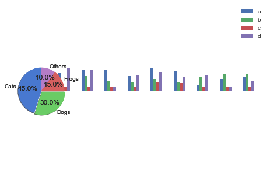
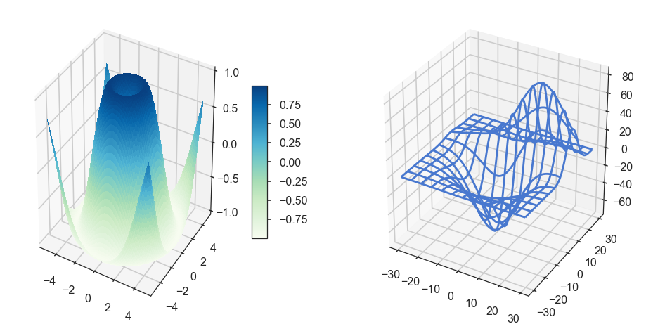

# 4 Display of Statistical Data
<!-- toc orderedList:0 depthFrom:1 depthTo:6 -->

* [4 Display of Statistical Data](#4-display-of-statistical-data)
  * [4.1 Datatypes](#41-datatypes)
    * [4.1.1 Categorical](#411-categorical)
    * [4.1.2 Numerical](#412-numerical)
  * [4.2 Plotting in Python](#42-plotting-in-python)
    * [4.2.1 Functional and Object-Oriented Approaches to Plotting](#421-functional-and-object-oriented-approaches-to-plotting)
    * [4.2.2 Interactive Plots](#422-interactive-plots)
  * [4.3 Displaying Statistical Datasets](#43-displaying-statistical-datasets)
    * [4.3.1 Univariate Data](#431-univariate-data)
    * [4.3.2 Bivariate and Multivariate Plots](#432-bivariate-and-multivariate-plots)
  * [4.4 Exercises](#44-exercises)

<!-- tocstop -->


## 4.1 Datatypes

### 4.1.1 Categorical

* a) Boolean
* b) Nominal
* c) Ordinal

### 4.1.2 Numerical
* a) Numerical Continuous
* b) Numerical Discrete

## 4.2 Plotting in Python

matplotlib contains different modules and features:
matplotlib.pyplot This is the module that is commonly used to generate plots.
It provides the interface to the plotting library in matplotlib, and is by convention imported in Python functions and modules with
```py
import matplotlib.pyplot as plt.
```
pyplot handles lots of little details, such as creating figures and axes for the plot, so that the user can concentrate on the data analysis.

```matplotlib.mlab``` Contains a number of functions that are commonly used in Matlab, such as find, griddata, etc.

"backends" matplotlib can produce output in many different formats, which are referred to as backends:
* In a Jupyter Notebook, or in a Jupyter QtConsole, the command ```%matplotlib``` inline directs output into the current browser window. (%pylab inline is a combination of loading pylab, and directing plot-output inline.)
* In the same environment, %matplotlib qt41 directs the output into a separate graphics window (Fig. 2.4). This allows panning and zooming the plot, and interactive selection of points on the plot by the user, with the command plt.ginput.
* With plt.savefig output can be directed to external files, e.g., in PDF, PNG, or JPG format.

pylab is a convenience module that bulk imports matplotlib.pyplot (for plotting) and numpy (for mathematics and working with arrays) in a single name space.
Although many examples use pylab, it is no longer recommended, and should only be used in IPython, to facilitate interactive development of code.


### 4.2.1 Functional and Object-Oriented Approaches to Plotting

* First, consider the frequently used pyplot style:


```python
# Import the required packages,
# with their conventional names
import matplotlib.pyplot as plt
import numpy as np
# Generate the data
x = np.arange(0, 10, 0.2)
y = np.sin(x)
# Generate the plot
plt.plot(x, y)
# Display it on the screen
plt.show()
```


* Second, a more pythonic, object oriented style, which may be clearer when working with multiple figures and axes. Compared to the example above, only the section entitled “# Generate the plot” changes:


```python
# Generate the plot
fig = plt.figure() # Generate the figure
ax = fig.add_subplot(111) # Add an axis to that figure
ax.plot(x,y) # Add a plot to that axis
plt.show()
```


* For interactive data analysis, it is convenient to load the most common commands from numpy and matplotlib.pyplot into the current workspace.
This is achieved with pylab, and leads to a Matlab-like coding style:


```python
from pylab import *
x = arange(0, 10, 0.2)
y = sin(x)
plot(x, y)
show()
```


```python
# Import the required packages
import matplotlib.pyplot as plt
import numpy as np

# Generate the data
x = np.arange(0, 10, 0.2)
y = np.sin(x)
z = np.cos(x)

# Generate the figure and the axes
fig, axs = plt.subplots(nrows=2, ncols=1)

# On the first axis, plot the sine and label the ordinate
axs[0].plot(x,y)
axs[0].set_ylabel('Sine')

# On the second axis, plot the cosine
axs[1].plot(x,z)
axs[1].set_ylabel('Cosine')
# Display the resulting plot
plt.show()
```


### 4.2.2 Interactive Plots

matplotlib provides different ways to interact with the user.
Unfortunately, this interaction is less intuitive than in Matlab.
The examples below may help to bypass most of these problems.
They show how to
* Exactly position figures on the screen.
* Pause between two plots, and proceed automatically after a few seconds.
* Proceed on a click or keyboard hit.
* Evaluate keyboard entries.


```python
# %load ch04/L4_1_interactivePlots.py
# Source: http://scipy-central.org/item/84/1/simple-interactive-matplotlib-plots

'''Interactive graphs with Matplotlib have haunted me. So here I have collected a number of
tricks that should make interactive use of plots simpler. The functions below show how to

- Position figures on the screen (e.g. top left half of display)
- Pause to display the plot, and proceed automatically after a few sec
- Proceed on a click, or a keyboard hit
- Evaluate keyboard inputs

author: Thomas Haslwanter
date:   Nov-2015
ver:    1.1
license: CC BY-SA 4.0

'''
# Import standard packages
import numpy as np
import matplotlib.pyplot as plt

# additional packages
try:
    import tkinter as tk
except ImportError:     #different capitalization in Python 2.x
    import Tkinter as tk

t = np.arange(0,10,0.1)
c = np.cos(t)
s = np.sin(t)

def normalPlot():
    '''Just show a plot. The progam stops, and only continues when the plot is closed,
    either by hitting the "Window Close" button, or by typing "ALT+F4". '''

    plt.plot(t,s)
    plt.title('Normal plot: you have to close it to continue\nby clicking the "Window Close" button, or by hitting "ALT+F4"')
    plt.show()

def positionOnScreen():
    '''Position two plots on your screen. This uses the Tickle-backend, which I think is the default on all platforms.'''

    # Get the screen size
    root = tk.Tk()
    (screen_w, screen_h) = (root.winfo_screenwidth(), root.winfo_screenheight())
    root.destroy()

    def positionFigure(figure, geometry):
        '''Position one figure on a given location on the screen.
        This works for Tk and for Qt5 backends, but may fail on others.'''

        mgr = figure.canvas.manager
        (pos_x, pos_y, width, height) = geometry
        try:
            # positioning commands for Tk
            position = '{0}x{1}+{2}+{3}'.format(width, height, pos_x, pos_y)
            mgr.window.geometry(position)
        except TypeError:
            # positioning commands for Qt5
            mgr.window.setGeometry(pos_x, pos_y, width, height)

    # The program continues after the first plot
    fig = plt.figure()
    ax = fig.add_subplot(111)
    ax.plot(t,c)
    ax.set_title('Top Left: Close this one last')

    # Position the first graph in the top-left half of the screen
    topLeft = (0, 0, screen_w//2, screen_h//2)
    positionFigure(fig, topLeft)

    # Put another graph in the top right half
    fig2 = plt.figure()
    ax2 = fig2.add_subplot(111)
    ax2.plot(t,s)
    # I don't completely understand why this one has to be closed first. But otherwise the program gets unstable.
    ax2.set_title('Top Right: Close this one first (e.g. with ALT+F4)')

    topRight = (screen_w//2, 0, screen_w//2, screen_h//2)
    positionFigure(fig2, topRight)

    plt.show()

def showAndPause():
    '''Show a plot only for 2 seconds, and then proceed automatically'''
    plt.plot(t,s)
    plt.title('Don''t touch! I will proceed automatically.')

    plt.show(block=False)
    duration = 2    # [sec]
    plt.pause(duration)
    plt.close()

def waitForInput():
    ''' This time, proceed with a click or by hitting any key '''
    plt.plot(t,c)
    plt.title('Click in that window, or hit any key to continue')

    plt.waitforbuttonpress()
    plt.close()

def keySelection():
    '''Wait for user intput, and proceed depending on the key entered.
    This is a bit complex. But None of the versions I tried without
    key binding were completely stable.'''

    fig, ax = plt.subplots()
    fig.canvas.mpl_connect('key_press_event', on_key_event)

    # Disable default Matplotlib shortcut keys:
    keymaps = [param for param in plt.rcParams if param.find('keymap') >= 0]
    for key in keymaps:
        plt.rcParams[key] = ''

    ax.plot(t,c)
    ax.set_title('First, enter a vowel:')
    plt.show()

def on_key_event(event):
    '''Keyboard interaction'''

    #print('you pressed %s'%event.key)
    key = event.key

    # In Python 2.x, the key gets indicated as "alt+[key]"
    # Bypass this bug:
    if key.find('alt') == 0:
        key = key.split('+')[1]

    curAxis = plt.gca()
    if key in 'aeiou':
        curAxis.set_title('Well done!')
        plt.pause(1)
        plt.close()
    else:
        curAxis.set_title(key + ' is not a vowel: try again to find a vowel ....')
        plt.draw()

if __name__ == '__main__':
    normalPlot()
    positionOnScreen()
    showAndPause()
    waitForInput()
    keySelection()

```

* https://github.com/thomas-haslwanter/statsintro_python/tree/master/ISP/Code_Quantlets/04_DataDisplay/gettingStarted.

## 4.3 Displaying Statistical Datasets


The first step in the data analysis should always be a visual inspection of the raw- data.
Between 30 and 50 % of our cortex are involved in the processing of visual information, and as a result our brain is very good at recognizing patterns in visually represented data.
The trick is choosing the most informative type of display for your data.
The easiest way to find and implement one of the many image types that matplotlib offers is to browse their gallery (http://matplotlib.org/gallery.html), and copy the corresponding Python code into your program.
For statistical data analysis, the Python package seaborn (http://www.stanford.edu/~mwaskom/software/seaborn/) builds on matplotlib, and aims to provide a concise, high-level interface for drawing statistical graphics that are both informative and attractive.
Also pandas builds on matplotlib and offers many convenient ways to visualize DataFrames.
Other interesting plotting packages are:
* plot.ly is a package that is available for Python, Matlab, and R, and makes beautiful graphs (https://plot.ly).
* bokeh is a Python interactive visualization library that targets modern web browsers for presentation. bokeh can help anyone who would like to quickly and easily create interactive plots, dashboards, and data applications (http://bokeh.pydata.org/).
* ggplot for Python. It emulates the R-package ggplot, which is loved by many R-users (http://ggplot.yhathq.com/).


### 4.3.1 Univariate Data


```python
# Import standard packages import numpy as np
import matplotlib.pyplot as plt
import pandas as pd
import scipy.stats as stats
import seaborn as sns

# Generate the data
x = np.random.randn(500)

# Plot-command start ---------------------
plt.plot(x, '.')
# Plot-command end -----------------------

# Show plot
plt.show()

```


* a) Scatter Plots


```python
plt.plot(x, '.')
```

or, equivalently,


```python
plt.scatter(np.arange(len(x), x))
```

Note: In cases where we only have few discrete values on the x-axis (e.g., Group1, Group2, Group3), it may be helpful to spread overlapping data points slightly (also referred to as “adding jitter”) to show each data point. An exam- ple can be found at http://stanford.edu/~mwaskom/software/seaborn/generated/seaborn.stripplot.html)

* b) Histograms


```python
plt.hist(x, bins=25)
```

* c) Kernel-Density-Estimation (KDE) Plots


```python
sns.kdeplot(x)
```

* d) Cumulative Frequencies


```python
plt.plot(stats.cumfreq(x,numbins)[0])
```

* e) Error-Bars


```python
index = np.arange(5)
y = index**2
errorBar = index/2	# just for demonstration
plt.errorbar(index,y, yerr=errorBar, fmt='o', capsize=5, capthick=3)
plt.show()
```


* f) Box Plots


```python
plt.boxplot(x, sym='*')
```


```python
# Generate the data
nd = stats.norm
data = nd.rvs(size=(100))

nd2 = stats.norm(loc = 3, scale = 1.5)
data2 = nd2.rvs(size=(100))

# Use pandas and the seaborn package
# for the violin plot
df = pd.DataFrame({'Girls':data, 'Boys':data2})
sns.violinplot(df)
```

    C:\Anaconda36\lib\site-packages\seaborn\categorical.py:2342: UserWarning: The violinplot API has been changed. Attempting to adjust your arguments for the new API (which might not work). Please update your code. See the version 0.6 release notes for more info.
      warnings.warn(msg, UserWarning)


    <matplotlib.axes._subplots.AxesSubplot at 0xb8189496a0>


* g) Grouped Bar Charts


```python
df = pd.DataFrame(np.random.rand(10, 4), columns=['a', 'b', 'c', 'd'])
df.plot(kind='bar', grid=False)
```


    <matplotlib.axes._subplots.AxesSubplot at 0xb818e82940>


* h) Pie Charts


```python
import seaborn as sns
import matplotlib.pyplot as plt

txtLabels = 'Cats', 'Dogs', 'Frogs', 'Others'
fractions = [45, 30, 15, 10]
offsets =(0, 0.05, 0, 0)

plt.pie(fractions, explode=offsets, labels=txtLabels, autopct='%1.1f%%', shadow=True,
        startangle=90, colors=sns.color_palette('muted') )
plt.axis('equal')
plt.show()

```





* i) Programs: Data Display


```python
# %load ch04/04_DataDisplay/showPlots/ISP_showPlots.py
''' Show different ways to present statistical data

The examples contain:
- scatter plots, with 1-dimensional and higher-dimensional data
- histograms
- cumulative density functions
- KDE-plots
- boxplots
- errorbars
- violinplots
- barplots
- grouped boxplots
- pieplots
- scatterplots, with markersize proportional to the value of a corresponding variable
- 3D surface and wireframe plots
'''

# Copyright(c) 2015, Thomas Haslwanter. All rights reserved, under the CC BY-SA 4.0 International License

# First, import the libraries that you are going to need. You could also do
# that later, but it is better style to do that at the beginning.

# pylab imports the numpy, scipy, and matplotlib.pyplot libraries into the
# current environment

# Import standard packages
import numpy as np
import matplotlib.pyplot as plt
import scipy.stats as stats
import seaborn as sns
import pandas as pd
import os

# additional packages
import matplotlib as mpl

import sys
sys.path.append(os.path.join('..', '..', 'Utilities'))
try:
# Import formatting commands if directory "Utilities" is available
    from ISP_mystyle import setFonts, showData

except ImportError:
# Ensure correct performance otherwise
    def setFonts(*options):
        return
    def showData(*options):
        plt.show()
        return

def printout(outFile, xlabel = '', ylabel='', title='', outDir = '.'):
    '''Save the current figure to a file, and then display it'''

    plt.xlabel(xlabel)
    plt.ylabel(ylabel)
    plt.title(title)

    plt.tight_layout

    xlim = plt.gca().get_xlim()
    plt.hlines(0, xlim[0], xlim[1], linestyles='--', colors='#999999')
    plt.gca().set_xlim(xlim)

    saveTo = os.path.join(outDir, outFile)
    plt.savefig(saveTo, dpi=200)

    print('OutDir: {0}'.format(outDir))
    print('Figure saved to {0}'.format(outFile))

    plt.show()
    plt.close()

def simplePlots():
    '''Demonstrate the generation of different statistical standard plots'''

    # Univariate data -------------------------

    # Make sure that always the same random numbers are generated
    np.random.seed(1234)

    # Generate data that are normally distributed
    x = np.random.randn(500)

    # Other graphics settings
    sns.set(context='poster', style='ticks', palette=sns.color_palette('muted'))

    # Set the fonts the way I like them
    setFonts(32)

    # Scatter plot
    plt.scatter(np.arange(len(x)), x)
    plt.xlim([0, len(x)])

    # Save and show the data, in a systematic format
    printout('scatterPlot.png', xlabel='Datapoints', ylabel='Values', title='Scatter')

    # Histogram
    plt.hist(x)
    printout('histogram_plain.png', xlabel='Data Values',
             ylabel='Frequency', title='Histogram, default settings')

    plt.hist(x,25)
    printout('histogram.png', xlabel='Data Values', ylabel='Frequency',
             title='Histogram, 25 bins')

    # Cumulative probability density
    numbins = 20
    plt.plot(stats.cumfreq(x,numbins)[0])
    printout('CumulativeFrequencyFunction.png', xlabel='Data Values',
             ylabel='CumFreq', title='Cumulative Frequency')

    # KDE-plot
    sns.kdeplot(x)
    printout('kde.png', xlabel='Data Values', ylabel='Density',
            title='KDE_plot')

    # Boxplot
    # The ox consists of the first, second (middle) and third quartile
    plt.boxplot(x, sym='*')
    printout('boxplot.png', xlabel='Values', title='Boxplot')

    plt.boxplot(x, sym='*', vert=False)
    plt.title('Boxplot, horizontal')
    plt.xlabel('Values')
    plt.show()

    # Errorbars
    x = np.arange(5)
    y = x**2
    errorBar = x/2
    plt.errorbar(x,y, yerr=errorBar, fmt='o', capsize=5, capthick=3)
    plt.xlim([-0.2, 4.2])
    plt.ylim([-0.2, 19])
    printout('Errorbars.png', xlabel='Data Values', ylabel='Measurements', title='Errorbars')

    # Violinplot
    nd = stats.norm
    data = nd.rvs(size=(100))

    nd2 = stats.norm(loc = 3, scale = 1.5)
    data2 = nd2.rvs(size=(100))

    # Use pandas and the seaborn package for the violin plot
    df = pd.DataFrame({'Girls':data, 'Boys':data2})
    sns.violinplot(df)

    printout('violinplot.png', title='Violinplot')

    # Barplot
    # The font-size is set such that the legend does not overlap with the data
    np.random.seed(1234)
    setFonts(20)

    df = pd.DataFrame(np.random.rand(10, 4), columns=['a', 'b', 'c', 'd'])
    df.plot(kind='bar', grid=False, color=sns.color_palette('muted'))

    showData('barplot.png')
    setFonts(28)

    # Bivariate Plots
    df2 = pd.DataFrame(np.random.rand(50, 3), columns=['a', 'b', 'c'])
    df2.plot(kind='scatter', x='a', y='b', s=df2['c']*500);
    plt.axhline(0, ls='--', color='#999999')
    plt.axvline(0, ls='--', color='#999999')
    printout('bivariate.png')

    # Grouped Boxplot
    sns.set_style('whitegrid')
    sns.boxplot(df)
    setFonts(28)
    printout('groupedBoxplot.png', title='sns.boxplot')

    sns.set_style('ticks')

    # Pieplot
    txtLabels = 'Cats', 'Dogs', 'Frogs', 'Others'
    fractions = [45, 30, 15, 10]
    offsets =(0, 0.05, 0, 0)

    plt.pie(fractions, explode=offsets, labels=txtLabels,
            autopct='%1.1f%%', shadow=False, startangle=90,
            colors=sns.color_palette('muted') )
    plt.axis('equal')
    printout('piePlot.png', title=' ')

def show3D():
    '''Generation of 3D plots'''

    # imports specific to the plots in this example
    from matplotlib import cm   # colormaps

    # This module is required for 3D plots!
    from mpl_toolkits.mplot3d import Axes3D

    # Twice as wide as it is tall.
    fig = plt.figure(figsize=plt.figaspect(0.5))
    setFonts(16)

    #---- First subplot
    # Generate the data
    X = np.arange(-5, 5, 0.1)
    Y = np.arange(-5, 5, 0.1)
    X, Y = np.meshgrid(X, Y)
    R = np.sqrt(X**2 + Y**2)
    Z = np.sin(R)

    # Note the definition of "projection", required for 3D  plots
    #plt.style.use('ggplot')

    ax = fig.add_subplot(1, 2, 1, projection='3d')
    surf = ax.plot_surface(X, Y, Z, rstride=1, cstride=1, cmap=cm.GnBu,
            linewidth=0, antialiased=False)
    #surf = ax.plot_surface(X, Y, Z, rstride=1, cstride=1, cmap=cm.viridis_r,
            #linewidth=0, antialiased=False)
    ax.set_zlim3d(-1.01, 1.01)

    fig.colorbar(surf, shrink=0.5, aspect=10)

    #---- Second subplot
    # Get some 3d test-data
    from mpl_toolkits.mplot3d.axes3d import get_test_data

    ax = fig.add_subplot(1, 2, 2, projection='3d')
    X, Y, Z = get_test_data(0.05)
    ax.plot_wireframe(X, Y, Z, rstride=10, cstride=10)

    showData('3dGraph.png')

if __name__ == '__main__':
    simplePlots()
    show3D()

```

    OutDir: .
    Figure saved to scatterPlot.png


    OutDir: .
    Figure saved to histogram_plain.png


    OutDir: .
    Figure saved to histogram.png


    OutDir: .
    Figure saved to CumulativeFrequencyFunction.png


    ---------------------------------------------------------------------------

    TypeError                                 Traceback (most recent call last)

    <ipython-input-28-5572fdc2b71b> in <module>()
        229
        230 if __name__ == '__main__':
    --> 231     simplePlots()
        232     show3D()


    <ipython-input-28-5572fdc2b71b> in simplePlots()
        112
        113     # KDE-plot
    --> 114     sns.kdeplot(x)
        115     printout('kde.png', xlabel='Data Values', ylabel='Density',
        116             title='KDE_plot')


    C:\Anaconda36\lib\site-packages\seaborn\distributions.py in kdeplot(data, data2, shade, vertical, kernel, bw, gridsize, cut, clip, legend, cumulative, shade_lowest, ax, **kwargs)
        602         ax = _univariate_kdeplot(data, shade, vertical, kernel, bw,
        603                                  gridsize, cut, clip, legend, ax,
    --> 604                                  cumulative=cumulative, **kwargs)
        605
        606     return ax


    C:\Anaconda36\lib\site-packages\seaborn\distributions.py in _univariate_kdeplot(data, shade, vertical, kernel, bw, gridsize, cut, clip, legend, ax, cumulative, **kwargs)
        268         x, y = _statsmodels_univariate_kde(data, kernel, bw,
        269                                            gridsize, cut, clip,
    --> 270                                            cumulative=cumulative)
        271     else:
        272         # Fall back to scipy if missing statsmodels


    C:\Anaconda36\lib\site-packages\seaborn\distributions.py in _statsmodels_univariate_kde(data, kernel, bw, gridsize, cut, clip, cumulative)
        326     fft = kernel == "gau"
        327     kde = smnp.KDEUnivariate(data)
    --> 328     kde.fit(kernel, bw, fft, gridsize=gridsize, cut=cut, clip=clip)
        329     if cumulative:
        330         grid, y = kde.support, kde.cdf


    C:\Anaconda36\lib\site-packages\statsmodels\nonparametric\kde.py in fit(self, kernel, bw, fft, weights, gridsize, adjust, cut, clip)
        144             density, grid, bw = kdensityfft(endog, kernel=kernel, bw=bw,
        145                     adjust=adjust, weights=weights, gridsize=gridsize,
    --> 146                     clip=clip, cut=cut)
        147         else:
        148             density, grid, bw = kdensity(endog, kernel=kernel, bw=bw,


    C:\Anaconda36\lib\site-packages\statsmodels\nonparametric\kde.py in kdensityfft(X, kernel, bw, weights, gridsize, adjust, clip, cut, retgrid)
        504     zstar = silverman_transform(bw, gridsize, RANGE)*y # 3.49 in Silverman
        505                                                    # 3.50 w Gaussian kernel
    --> 506     f = revrt(zstar)
        507     if retgrid:
        508         return f, grid, bw


    C:\Anaconda36\lib\site-packages\statsmodels\nonparametric\kdetools.py in revrt(X, m)
         18     if m is None:
         19         m = len(X)
    ---> 20     y = X[:m/2+1] + np.r_[0,X[m/2+1:],0]*1j
         21     return np.fft.irfft(y)*m
         22


    TypeError: slice indices must be integers or None or have an __index__ method


### 4.3.2 Bivariate and Multivariate Plots

* a) Bivariate Scatter Plots


```python
df2 = pd.DataFrame(np.random.rand(50, 4), columns=['a', 'b', 'c', 'd'])
df2.plot(kind='scatter', x='a', y='b', s=df['c'] *300);
```

* https://github.com/thomas-haslwanter/statsintro_python/tree/master/ISP/Code_Quantlets/04_DataDisplay/showPlots.

* b) 3D Plots


```python
# imports specific to the plots in this example
import numpy as np
from matplotlib import cm
from mpl_toolkits.mplot3d.axes3d import get_test_data
# Twice as wide as it is tall.
fig = plt.figure(figsize=plt.figaspect(0.5))
#---- First subplot
# Note that the declaration "projection='3d'"
# is required for 3d plots!
ax = fig.add_subplot(1, 2, 1, projection='3d')
# Generate the grid
X = np.arange(-5, 5, 0.1)
Y = np.arange(-5, 5, 0.1)
X, Y = np.meshgrid(X, Y)
# Generate the surface data
R = np.sqrt(X**2 + Y**2)
Z = np.sin(R)
# Plot the surface
surf = ax.plot_surface(X, Y, Z, rstride=1, cstride=1,
cmap=cm.GnBu, linewidth=0, antialiased=False)
ax.set_zlim3d(-1.01, 1.01)
fig.colorbar(surf, shrink=0.5, aspect=10)
#---- Second subplot
ax = fig.add_subplot(1, 2, 2, projection='3d')
X, Y, Z = get_test_data(0.05)
ax.plot_wireframe(X, Y, Z, rstride=10, cstride=10)
outfile = '3dGraph.png'
plt.savefig(outfile, dpi=200)
print('Image saved to {0}'.format(outfile))
plt.show()
```

    Image saved to 3dGraph.png





## 4.4 Exercises

* 4.1 Data Display
    1. Read in the data from ‘Data\amstat\babyboom.dat.txt’.
    2. Inspect them visually, and give a numerical description of the data.
    3. Are the data normally distributed?


```python

```
