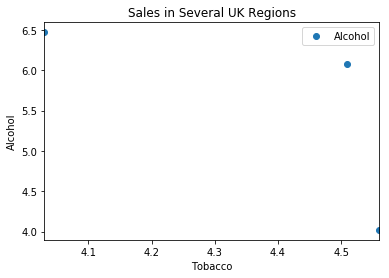

# 11 Linear Regression Models
<!-- toc orderedList:0 depthFrom:1 depthTo:6 -->

* [11 Linear Regression Models](#11-linear-regression-models)
  * [11.1 Linear Correlation](#111-linear-correlation)
    * [11.1.1 Correlation Coefficient](#1111-correlation-coefficient)
    * [11.1.2 Rank Correlation](#1112-rank-correlation)
  * [11.2 General Linear Regression Model](#112-general-linear-regression-model)
    * [11.2.1 Example 1: Simple Linear Regression](#1121-example-1-simple-linear-regression)
    * [11.2.2 Example 2: Quadratic Fit](#1122-example-2-quadratic-fit)
    * [11.2.3 Coefficient of Determination](#1123-coefficient-of-determination)
  * [11.3 Patsy: The Formula Language](#113-patsy-the-formula-language)
    * [11.3.1 Design Matrix](#1131-design-matrix)
  * [11.4 Linear Regression Analysis with Python](#114-linear-regression-analysis-with-python)
    * [11.4.1 Example 1: Line Fit with Confidence Intervals](#1141-example-1-line-fit-with-confidence-intervals)
    * [11.4.2 Example 2: Noisy Quadratic Polynomial](#1142-example-2-noisy-quadratic-polynomial)
  * [11.5 Model Results of Linear Regression Models](#115-model-results-of-linear-regression-models)
    * [11.5.1 Example: Tobacco and Alcohol in the UK](#1151-example-tobacco-and-alcohol-in-the-uk)
    * [11.5.2 Definitions for Regression with Intercept](#1152-definitions-for-regression-with-intercept)
    * [11.5.3 The R2 Value](#1153-the-r2-value)
    * [11.5.4 2: The Adjusted R2 Value](#1154-2-the-adjusted-r2-value)
    * [11.5.5 Model Coefficients and Their Interpretation](#1155-model-coefficients-and-their-interpretation)
    * [11.5.6 Analysis of Residuals](#1156-analysis-of-residuals)
    * [11.5.7 Outliers](#1157-outliers)
    * [11.5.8 Regression Using Sklearn](#1158-regression-using-sklearn)
    * [11.5.9 Conclusion](#1159-conclusion)
  * [11.6 Assumptions of Linear Regression Models](#116-assumptions-of-linear-regression-models)
  * [11.7 Interpreting the Results of Linear Regression Models](#117-interpreting-the-results-of-linear-regression-models)
  * [11.8 Bootstrapping](#118-bootstrapping)
  * [11.9 Exercises](#119-exercises)
    * [11.1  Correlation](#111-correlation)
    * [11.2  Regression](#112-regression)
    * [11.3  Normality Check](#113-normality-check)

<!-- tocstop -->


## 11.1 Linear Correlation

### 11.1.1 Correlation Coefficient

### 11.1.2 Rank Correlation

## 11.2 General Linear Regression Model

* https://github.com/thomas-haslwanter/statsintro_python/tree/master/ISP/Code_Quantlets/11_LinearModels/bivariate.

### 11.2.1 Example 1: Simple Linear Regression

### 11.2.2 Example 2: Quadratic Fit

### 11.2.3 Coefficient of Determination

* a) Relation to Unexplained Variance

* b) "Good" Fits

## 11.3 Patsy: The Formula Language

### 11.3.1 Design Matrix

* a) Definition

* b) Examples

## 11.4 Linear Regression Analysis with Python

### 11.4.1 Example 1: Line Fit with Confidence Intervals

### 11.4.2 Example 2: Noisy Quadratic Polynomial


```python
import numpy as np
import matplotlib.pyplot as plt
''' Generate a noisy, slightly quadratic dataset '''
x = np.arange(100)
y = 150 + 3*x + 0.03*x**2 + 5*np.random.randn(len(x))
# Create the Design Matrices for the linear, quadratic,
# and cubic fit
M1 = np.vstack( (np.ones_like(x), x) ).T
M2 = np.vstack( (np.ones_like(x), x, x**2) ).T
M3 = np.vstack( (np.ones_like(x), x, x**2, x**3) ).T
# an equivalent alternative solution with statsmodels would be
# M1 = sm.add_constant(x)
# Solve the equations
p1 = np.linalg.lstsq(M1, y)
p2 = np.linalg.lstsq(M2, y)
p3 = np.linalg.lstsq(M3, y)
np.set_printoptions(precision=3)
print('The coefficients from the linear fit: {0}'.format(p1[0]))
```

    The coefficients from the linear fit: [ 100.727    5.985]


```python
print('The coefficients from the quadratic fit: {0}'.format(p2[0]))
```

    The coefficients from the quadratic fit: [  1.505e+02   2.938e+00   3.078e-02]


```python
print('The coefficients from the cubic fit: {0}'.format(p3[0]))
```

    The coefficients from the cubic fit: [  1.489e+02   3.136e+00   2.574e-02   3.392e-05]


```python
'''Solution with the tools from statsmodels'''
import statsmodels.api as sm
Res1 = sm.OLS(y, M1).fit()
Res2 = sm.OLS(y, M2).fit()
Res3 = sm.OLS(y, M3).fit()
print(Res1.summary2())
```

                     Results: Ordinary least squares
    =================================================================
    Model:              OLS              Adj. R-squared:     0.982
    Dependent Variable: y                AIC:                918.6751
    Date:               2017-04-05 01:48 BIC:                923.8855
    No. Observations:   100              Log-Likelihood:     -457.34
    Df Model:           1                F-statistic:        5323.
    Df Residuals:       98               Prob (F-statistic): 3.22e-87
    R-squared:          0.982            Scale:              560.64
    -------------------------------------------------------------------
             Coef.     Std.Err.      t      P>|t|     [0.025    0.975]
    -------------------------------------------------------------------
    const   100.7272     4.7003   21.4301   0.0000   91.3996   110.0547
    x1        5.9847     0.0820   72.9610   0.0000    5.8220     6.1475
    -----------------------------------------------------------------
    Omnibus:               10.155       Durbin-Watson:          0.084
    Prob(Omnibus):         0.006        Jarque-Bera (JB):       8.885
    Skew:                  0.645        Prob(JB):               0.012
    Kurtosis:              2.317        Condition No.:          114
    =================================================================


```python
print('The AIC-value is {0:4.1f} for the linear fit, \n \
{1:4.1f} for the quadratic fit, and \n \
{2:4.1f} for the cubic fit'.format(Res1.aic,
                                   Res2.aic,
                                   Res3.aic))
```

    The AIC-value is 918.7 for the linear fit,
     605.4 for the quadratic fit, and
     605.6 for the cubic fit


```python
'''Formula-based modeling '''
import pandas as pd
import statsmodels.formula.api as smf
# Turn the data into a pandas DataFrame, so that we
# can address them in the formulas with their name
df = pd.DataFrame({'x':x, 'y':y})
# Fit the models, and show the results
Res1F = smf.ols('y~x', df).fit()
Res2F = smf.ols('y ~ x+I(x**2)', df).fit()
Res3F = smf.ols('y ~ x+I(x**2)+I(x**3)', df).fit()
#As example, display parameters for the quadratic fit
Res2F.params
```


    Intercept    150.492875
    x              2.937850
    I(x ** 2)      0.030777
    dtype: float64


```python
Res2F.bse
```


    Intercept    1.446598
    x            0.067534
    I(x ** 2)    0.000660
    dtype: float64


```python
Res2F.conf_int()
```


<div>
<table border="1" class="dataframe">
  <thead>
    <tr style="text-align: right;">
      <th></th>
      <th>0</th>
      <th>1</th>
    </tr>
  </thead>
  <tbody>
    <tr>
      <th>Intercept</th>
      <td>147.621779</td>
      <td>153.363971</td>
    </tr>
    <tr>
      <th>x</th>
      <td>2.803815</td>
      <td>3.071886</td>
    </tr>
    <tr>
      <th>I(x ** 2)</th>
      <td>0.029466</td>
      <td>0.032087</td>
    </tr>
  </tbody>
</table>
</div>


## 11.5 Model Results of Linear Regression Models

### 11.5.1 Example: Tobacco and Alcohol in the UK


```python
import numpy as np
import pandas as pd
import matplotlib as mpl
import matplotlib.pyplot as plt
import statsmodels.formula.api as sm
from sklearn.linear_model import LinearRegression
from scipy import stats
```


```python
data_str = '''Region Alcohol Tobacco
North 6.47 4.03
Yorkshire 6.13 3.76
Northeast 6.19 3.77
East_Midlands 4.89 3.34
West_Midlands 5.63 3.47
East_Anglia 4.52 2.92
Southeast 5.89 3.20
Southwest 4.79 2.71
Wales 5.27 3.53
Scotland 6.08 4.51
Northern_Ireland 4.02 4.56'''
# Read in the data. Note that for Python 2.x,
# you have to change the "import" statement
from io import StringIO
df = pd.read_csv(StringIO(data_str), sep=r'\s+')
```


```python
# Plot the data
df.plot('Tobacco', 'Alcohol', style='o')
plt.ylabel('Alcohol')
plt.title('Sales in Several UK Regions')
plt.show()
```





```python
result = sm.ols('Alcohol ~ Tobacco', df[:-1]).fit()
print(result.summary())
```

                                OLS Regression Results
    ==============================================================================
    Dep. Variable:                Alcohol   R-squared:                       0.615
    Model:                            OLS   Adj. R-squared:                  0.567
    Method:                 Least Squares   F-statistic:                     12.78
    Date:                Wed, 05 Apr 2017   Prob (F-statistic):            0.00723
    Time:                        01:50:28   Log-Likelihood:                -4.9998
    No. Observations:                  10   AIC:                             14.00
    Df Residuals:                       8   BIC:                             14.60
    Df Model:                           1
    Covariance Type:            nonrobust
    ==============================================================================
                     coef    std err          t      P>|t|      [95.0% Conf. Int.]
    ------------------------------------------------------------------------------
    Intercept      2.0412      1.001      2.038      0.076        -0.268     4.350
    Tobacco        1.0059      0.281      3.576      0.007         0.357     1.655
    ==============================================================================
    Omnibus:                        2.542   Durbin-Watson:                   1.975
    Prob(Omnibus):                  0.281   Jarque-Bera (JB):                0.904
    Skew:                          -0.014   Prob(JB):                        0.636
    Kurtosis:                       1.527   Cond. No.                         27.2
    ==============================================================================

    Warnings:
    [1] Standard Errors assume that the covariance matrix of the errors is correctly specified.


    C:\Anaconda36\lib\site-packages\scipy\stats\stats.py:1327: UserWarning: kurtosistest only valid for n>=20 ... continuing anyway, n=10
      "anyway, n=%i" % int(n))


* https://github.com/thomas-haslwanter/statsintro_python/tree/master/ISP/Code_Quantlets/11_LinearModels/modelImplementations.
* The following is based on the blog of Connor Johnson (http://connor-johnson.com/2014/02/18/linear-regression-with-python/), with permission from the author.

### 11.5.2 Definitions for Regression with Intercept

### 11.5.3 The R2 Value

### 11.5.4 2: The Adjusted R2 Value

* a) The F-Test


```python
N = result.nobs
k = result.df_model+1
dfm, dfe = k-1, N - k
F = result.mse_model / result.mse_resid
p = 1.0 - stats.f.cdf(F,dfm,dfe)
print('F-statistic: {:.3f}, p-value: {:.5f}'.format( F, p ))
```

    F-statistic: 12.785, p-value: 0.00723


* b) Log-Likelihood Function


```python
N = result.nobs
SSR = result.ssr
s2 = SSR / N
L = (1.0/np.sqrt(2*np.pi*s2)) ** N*np.exp(-SSR/(s2*2.0))
print('ln(L) =', np.log( L ))
```

    ln(L) = -4.99975869739


* c) Information Content of Statistical Models: AIC and BIC

### 11.5.5 Model Coefficients and Their Interpretation

* a) Coefficients


```python
df['Ones'] = np.ones( len(df) )
Y = df.Alcohol[:-1]
X = df[['Tobacco','Ones']][:-1]
```

* b) Standard Error


```python
X = df.Tobacco[:-1]
# add a column of ones for the constant intercept term
X = np.vstack(( np.ones(X.size), X ))
# convert the numpy array to a matrix
X = np.matrix( X )
# perform the matrix multiplication,
# and then take the inverse
C = np.linalg.inv( X * X.T )
# multiply by the mean squared error of the residual
C *= result.mse_resid
# take the square root
SE = np.sqrt(C)
print(SE)
```

    [[ 1.001    nan]
     [   nan  0.281]]


    C:\Anaconda36\lib\site-packages\ipykernel\__main__.py:12: RuntimeWarning: invalid value encountered in sqrt


* c) t-Statistic


```python
i = 1
beta = result.params[i]
se = SE[i,i]
t = beta / se
print('t =', t)
```

    t = 3.57560845424


```python
N = result.nobs
k = result.df_model + 1
dof = N - k
p_onesided = 1.0 - stats.t( dof ).cdf( t )
p = p_onesided * 2.0
print('p = {0:.3f}'.format(p))
```

    p = 0.007


* d) Confidence Interval


```python
i = 0
# the estimated coefficient, and its variance
beta, c = result.params[i], SE[i,i]
# critical value of the t-statistic
N = result.nobs
P = result.df_model
dof = N - P - 1
z = stats.t( dof ).ppf(0.975)
# the confidence interval
print(beta - z * c, beta + z * c)
```

    -0.267917709371 4.35036388305


### 11.5.6 Analysis of Residuals

* a) Skewness and Kurtosis


```python
d = Y - result.fittedvalues
S = np.mean( d**3.0 ) / np.mean( d**2.0 ) **(3.0/2.0)
# equivalent to:
# S = stats.skew(result.resid, bias=True)
K = np.mean( d**4.0 ) / np.mean( d**2.0 ) **(4.0/2.0)
# equivalent to:
# K = stats.kurtosis(result.resid, fisher=False,
# bias=True)
print('Skewness: {:.3f}, Kurtosis: {:.3f}'.format(S,K))
```

    Skewness: -0.014, Kurtosis: 1.527


* b) Omnibus Test


```python
(K2, p) = stats.normaltest(result.resid)
print('Omnibus: {0:.3f}, p = {1:.3f}'.format(K2, p))
```

    Omnibus: 2.542, p = 0.281


    C:\Anaconda36\lib\site-packages\scipy\stats\stats.py:1327: UserWarning: kurtosistest only valid for n>=20 ... continuing anyway, n=10
      "anyway, n=%i" % int(n))


* c) Durbin–Watson


```python
DW = np.sum( np.diff( result.resid.values ) **2.0 ) \
/ result.ssr
print('Durbin-Watson: {:.5f}'.format( DW ))
```

    Durbin-Watson: 1.97535


* d) Jarque–Bera Test


```python
JB = (N/6.0) * ( S**2.0 + (1.0/4.0) *( K - 3.0 ) **2.0 )
p = 1.0 - stats.chi2(2).cdf(JB)
print('JB-statistic: {:.5f}, p-value: {:.5f}'.format( JB, p ))
```

    JB-statistic: 0.90421, p-value: 0.63629


* e) Condition Number


```python
X = np.matrix( X )
EV = np.linalg.eig( X * X.T )
print(EV)
```

    (array([   0.184,  136.515]), matrix([[-0.963, -0.268],
            [ 0.268, -0.963]]))


```python
CN = np.sqrt( EV[0].max() / EV[0].min() )
print('Condition No.: {:.5f}'.format( CN ))
```

    Condition No.: 27.22887


### 11.5.7 Outliers


```python
X = df[['Tobacco','Ones']]
Y = df.Alcohol
result = sm.OLS( Y, X ).fit()
result.summary()
```

    C:\Anaconda36\lib\site-packages\scipy\stats\stats.py:1327: UserWarning: kurtosistest only valid for n>=20 ... continuing anyway, n=11
      "anyway, n=%i" % int(n))


<table class="simpletable">
<caption>OLS Regression Results</caption>
<tr>
  <th>Dep. Variable:</th>         <td>Alcohol</td>     <th>  R-squared:         </th> <td>   0.050</td>
</tr>
<tr>
  <th>Model:</th>                   <td>OLS</td>       <th>  Adj. R-squared:    </th> <td>  -0.056</td>
</tr>
<tr>
  <th>Method:</th>             <td>Least Squares</td>  <th>  F-statistic:       </th> <td>  0.4735</td>
</tr>
<tr>
  <th>Date:</th>             <td>Wed, 05 Apr 2017</td> <th>  Prob (F-statistic):</th>  <td> 0.509</td>
</tr>
<tr>
  <th>Time:</th>                 <td>01:53:53</td>     <th>  Log-Likelihood:    </th> <td> -12.317</td>
</tr>
<tr>
  <th>No. Observations:</th>      <td>    11</td>      <th>  AIC:               </th> <td>   28.63</td>
</tr>
<tr>
  <th>Df Residuals:</th>          <td>     9</td>      <th>  BIC:               </th> <td>   29.43</td>
</tr>
<tr>
  <th>Df Model:</th>              <td>     1</td>      <th>                     </th>     <td> </td>
</tr>
<tr>
  <th>Covariance Type:</th>      <td>nonrobust</td>    <th>                     </th>     <td> </td>
</tr>
</table>
<table class="simpletable">
<tr>
     <td></td>        <th>coef</th>     <th>std err</th>      <th>t</th>      <th>P>|t|</th> <th>[95.0% Conf. Int.]</th>
</tr>
<tr>
  <th>Tobacco</th> <td>    0.3019</td> <td>    0.439</td> <td>    0.688</td> <td> 0.509</td> <td>   -0.691     1.295</td>
</tr>
<tr>
  <th>Ones</th>    <td>    4.3512</td> <td>    1.607</td> <td>    2.708</td> <td> 0.024</td> <td>    0.717     7.986</td>
</tr>
</table>
<table class="simpletable">
<tr>
  <th>Omnibus:</th>       <td> 3.123</td> <th>  Durbin-Watson:     </th> <td>   1.655</td>
</tr>
<tr>
  <th>Prob(Omnibus):</th> <td> 0.210</td> <th>  Jarque-Bera (JB):  </th> <td>   1.397</td>
</tr>
<tr>
  <th>Skew:</th>          <td>-0.873</td> <th>  Prob(JB):          </th> <td>   0.497</td>
</tr>
<tr>
  <th>Kurtosis:</th>      <td> 3.022</td> <th>  Cond. No.          </th> <td>    25.5</td>
</tr>
</table>


### 11.5.8 Regression Using Sklearn

scikit-learn is arguably the most advanced open source machine learning package available (http://scikit-learn.org). It provides simple and efficient tools for data mining and data analysis, covering supervised as well as unsupervised learning.
It provides tools for
* Classification Identifying to which set of categories a new observation belongs to.
* Regression Predicting a continuous value for a new example.
* Clustering Automatic grouping of similar objects into sets.
* Dimensionality reduction Reducing the number of random variables to con- sider.
* Model selection Comparing, validating, and choosing parameters and models.
* Preprocessing Feature extraction and normalization.


```python
data = np.matrix( df )
```


```python
cln = LinearRegression()
org = LinearRegression()
X, Y = data[:,2], data[:,1]
cln.fit( X[:-1], Y[:-1] )
org.fit( X, Y )
clean_score = '{0:.3f}'.format(cln.score( X[:-1], Y[:-1] ) )
original_score = '{0:.3f}'.format( org.score( X, Y ) )
```


```python
mpl.rcParams['font.size']=16
plt.plot( df.Tobacco[:-1], df.Alcohol[:-1], 'bo',
         markersize=10, label='All other regions, $R^$ = '+clean_score )
plt.hold(True)
plt.plot( df.Tobacco[-1:], df.Alcohol[-1:], 'r*',
         ms=20, lw=10, label='N. Ireland, outlier, $R^2$ = '+original_score)
```

    C:\Anaconda36\lib\site-packages\ipykernel\__main__.py:4: MatplotlibDeprecationWarning: pyplot.hold is deprecated.
        Future behavior will be consistent with the long-time default:
        plot commands add elements without first clearing the
        Axes and/or Figure.
    C:\Anaconda36\lib\site-packages\matplotlib\__init__.py:917: UserWarning: axes.hold is deprecated. Please remove it from your matplotlibrc and/or style files.
      warnings.warn(self.msg_depr_set % key)
    C:\Anaconda36\lib\site-packages\matplotlib\rcsetup.py:152: UserWarning: axes.hold is deprecated, will be removed in 3.0
      warnings.warn("axes.hold is deprecated, will be removed in 3.0")


    [<matplotlib.lines.Line2D at 0x33664aa9b0>]


```python
test = np.c_[np.arange(2.5, 4.85, 0.1)]
plt.plot( test, cln.predict( test ), 'k' )
plt.plot( test, org.predict( test ), 'k--' )
# plt.show()
```


    [<matplotlib.lines.Line2D at 0x336642dc88>]


```python
plt.xlabel('Tobacco') ; plt.xlim(2.5,4.75)
plt.ylabel('Alcohol') ; plt.ylim(2.75,7.0)
plt.title('Regression of Alcohol from Tobacco')
plt.grid()
plt.legend(loc='lower center')

plt.show()
```

### 11.5.9 Conclusion

## 11.6 Assumptions of Linear Regression Models

* https://github.com/thomas-haslwanter/statsintro_python/tree/master/ISP/Code_Quantlets/11_LinearModels/anscombe.
* This section and the next chapter are based on Wikipedia https://en.wikipedia.org/wiki/Linear_regression, last accessed 21 Oct 2015.

## 11.7 Interpreting the Results of Linear Regression Models

## 11.8 Bootstrapping

The application of bootstrapping in Python is much facilitated by the package scikits.bootstrap by Constantine Evans (http://github.org/cgevans/scikits-bootstrap).

* https://github.com/thomas-haslwanter/statsintro_python/tree/master/ISP/Code_Quantlets/11_LinearModels/simpleModels.

* https://github.com/thomas-haslwanter/statsintro_python/tree/master/ISP/Code_Quantlets/11_LinearModels/bootstrapDemo.

## 11.9 Exercises

### 11.1  Correlation
First read in the data for the average yearly temperature at the Sonnblick, Austria’s highest meteorological observatory, from the file __Data/data_others/AvgTemp.xls__. Then calculate the Pearson and Spearman correlation, and Kendall’s tau, for the temperature vs. year.
### 11.2  Regression
For the same data, calculate the yearly increase in temperature, assuming a linear increase with time. Is this increase significant?
### 11.3  Normality Check
For the data from the regression model, check if the model is ok by testing if the residuals are normally distributed (e.g., by using the Kolmogorov–Smirnov test).


```python

```
