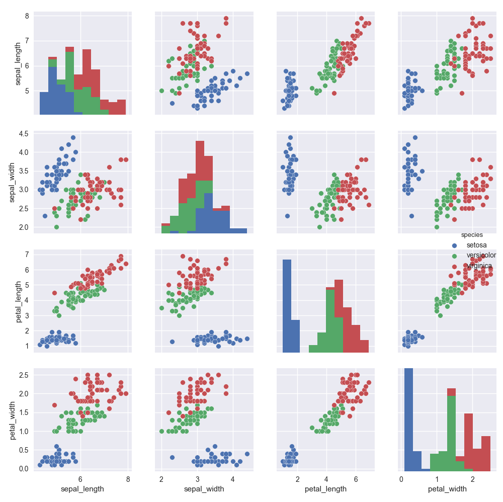

# 12 Multivariate Data Analysis
<!-- toc orderedList:0 depthFrom:1 depthTo:6 -->

* [12 Multivariate Data Analysis](#12-multivariate-data-analysis)
  * [12.1 Visualizing Multivariate Correlations](#121-visualizing-multivariate-correlations)
    * [12.1.1 Scatterplot Matrix](#1211-scatterplot-matrix)
    * [12.1.2 Correlation Matrix](#1212-correlation-matrix)
  * [12.2 Multilinear Regression](#122-multilinear-regression)

<!-- tocstop -->


## 12.1 Visualizing Multivariate Correlations

### 12.1.1 Scatterplot Matrix


```python
%matplotlib
import seaborn as sns
sns.set()
df = sns.load_dataset("iris")
sns.pairplot(df, hue="species", size=2.5)
```

    Using matplotlib backend: Qt5Agg


    <seaborn.axisgrid.PairGrid at 0x663f0fa7f0>




### 12.1.2 Correlation Matrix


```python
import numpy as np
import seaborn as sns
import matplotlib.pyplot as plt
sns.set(style="darkgrid")
rs = np.random.RandomState(33)
d = rs.normal(size=(100, 30))
f, ax = plt.subplots(figsize=(9, 9))
cmap = sns.diverging_palette(220, 10, as_cmap=True)
sns.corrplot(d, annot=False, sig_stars=False, diag_names=False, cmap=cmap, ax=ax)
f.tight_layout()
```

* http://seaborn.pydata.org/examples/many_pairwise_correlations.html

## 12.2 Multilinear Regression

* https://github.com/thomas-haslwanter/statsintro_python/tree/master/ISP/Code_Quantlets/12_Multivariate/multipleRegression.


```python

```
