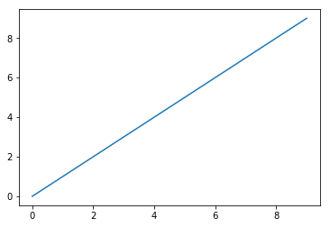

# 1 Getting Started with Scientific Python
<!-- toc orderedList:0 depthFrom:1 depthTo:6 -->

* [1 Getting Started with Scientific Python](#1-getting-started-with-scientific-python)
  * [1.1 Installation and Setup](#11-installation-and-setup)
  * [1.2 Numpy](#12-numpy)
    * [1.2.1 Numpy Arrays and Memory](#121-numpy-arrays-and-memory)
    * [1.2.2 Numpy Matrices](#122-numpy-matrices)
    * [1.2.3 Numpy Broadcasting](#123-numpy-broadcasting)
    * [1.2.4 Numpy Masked Arrays](#124-numpy-masked-arrays)
    * [1.2.5 Numpy Optimizations and Prospectus](#125-numpy-optimizations-and-prospectus)
  * [1.3 Matplotlib](#13-matplotlib)
    * [1.3.1 Alternatives to Matplotlib](#131-alternatives-to-matplotlib)
    * [1.3.2 Extensions to Matplotlib](#132-extensions-to-matplotlib)
  * [1.4 IPython](#14-ipython)
    * [1.4.1 IPython Notebook](#141-ipython-notebook)
  * [1.5 Scipy](#15-scipy)
  * [1.6 Pandas](#16-pandas)
    * [1.6.1 Series](#161-series)
    * [1.6.2 Dataframe](#162-dataframe)
  * [1.7 Sympy](#17-sympy)
  * [1.8 Interfacing with Compiled Libraries](#18-interfacing-with-compiled-libraries)
  * [1.9 Integrated Development Environments](#19-integrated-development-environments)
  * [1.10 Quick Guide to Performance and Parallel Programming](#110-quick-guide-to-performance-and-parallel-programming)
  * [1.11 Other Resources](#111-other-resources)
  * [References](#references)

<!-- tocstop -->


## 1.1 Installation and Setup

## 1.2 Numpy


```python
import numpy as np # recommended convention
x = np.array([1,2,3],dtype=np.float32)
x
```


    array([ 1.,  2.,  3.], dtype=float32)


```python
x.itemsize
```


    4


```python
np.sin(np.array([1,2,3],dtype=np.float32) )
```


    array([ 0.84147096,  0.90929741,  0.14112   ], dtype=float32)


```python
from math import sin
[sin(i) for i in [1,2,3]] # list comprehension
```


    [0.8414709848078965, 0.9092974268256817, 0.1411200080598672]


```python
x=np.array([ [1,2,3],[4,5,6] ])
x.shape
```


    (2, 3)


```python
x = np.array([ [1,2,3],[4,5,6] ])
x[:,0] # 0th column
```


    array([1, 4])


```python
x[:,1] # 1st column
```


    array([2, 5])


```python
x[0,:] # 0th row
```


    array([1, 2, 3])


```python
x[1,:] # 1st row
```


    array([4, 5, 6])


```python
x=np.array([ [1,2,3],[4,5,6] ])
x
```


    array([[1, 2, 3],
           [4, 5, 6]])


```python
x[:,1:] # all rows, 1st thru last column
```


    array([[2, 3],
           [5, 6]])


```python
x[:,::2] # all rows, every other column
```


    array([[1, 3],
           [4, 6]])


```python
x[:,::-1] # reverse order of columns
```


    array([[3, 2, 1],
           [6, 5, 4]])


### 1.2.1 Numpy Arrays and Memory


```python
%load_ext pymatbridge
```


```python
%%matlab
x = ones(3,3)
x(:,4)=ones(3,1) % tack on extra dimension
size(x)
```


    x =


         1     1     1

         1     1     1

         1     1     1


    x =


         1     1     1     1

         1     1     1     1

         1     1     1     1


    ans =


         3     4


```python
import numpy as np
x = np.ones((3,3))
x
```


    array([[ 1.,  1.,  1.],
           [ 1.,  1.,  1.],
           [ 1.,  1.,  1.]])


```python
x[:,[0,1,2,2]] # notice duplicated last dimension
y=x[:,[0,1,2,2]] # same as above, but do assign it to y
x[0,0]=999 # change element in x
x # changed
y # not changed!
x = np.ones((3,3))
y = x[:2,:2] # view of upper left piece
x[0,0] = 999 # change value
x
y
```


    array([[ 999.,    1.],
           [   1.,    1.]])


```python
x = np.arange(5) # create array
x
```


    array([0, 1, 2, 3, 4])


```python
y=x[[0,1,2]] # index by integer list to force copy
y
```


    array([0, 1, 2])


```python
z=x[:3] # slice creates view
z # note y and z have same entries
```


    array([0, 1, 2])


```python
x[0]=999 # change element of x
x
```


    array([999,   1,   2,   3,   4])


```python
y # note y is unaffected,
```


    array([0, 1, 2])


```python
z # but z is (it’s a view).
```


    array([999,   1,   2])


```python
from numpy.lib.stride_tricks import as_strided
x = np.arange(16)
y = as_strided(x,(7,4),(8,4)) # overlapped entries
y
```


    array([[ 0,  1,  2,  3],
           [ 2,  3,  4,  5],
           [ 4,  5,  6,  7],
           [ 6,  7,  8,  9],
           [ 8,  9, 10, 11],
           [10, 11, 12, 13],
           [12, 13, 14, 15]])


```python
x[::2]=99 # assign every other value
x
```


    array([99,  1, 99,  3, 99,  5, 99,  7, 99,  9, 99, 11, 99, 13, 99, 15])


```python
y # the changes appear because y is a view
```


    array([[99,  1, 99,  3],
           [99,  3, 99,  5],
           [99,  5, 99,  7],
           [99,  7, 99,  9],
           [99,  9, 99, 11],
           [99, 11, 99, 13],
           [99, 13, 99, 15]])


```python
n = 8 # number of elements
x = np.arange(n) # create array
k = 5 # desired number of rows
y = as_strided(x,(k,n-k+1),(x.itemsize,)*2)
y
```


    array([[0, 1, 2, 3],
           [1, 2, 3, 4],
           [2, 3, 4, 5],
           [3, 4, 5, 6],
           [4, 5, 6, 7]])


### 1.2.2 Numpy Matrices


```python
import numpy as np
A = np.matrix([[1,2,3],[4,5,6],[7,8,9]])
x = np.matrix([[1],[0],[0]])
A*x
```


    matrix([[1],
            [4],
            [7]])


```python
A = np.mat('1 2 3; 4 5 6; 7 8 9')
x = np.mat('1; 0; 0')
A*x
```


    matrix([[1],
            [4],
            [7]])


```python
A = np.matrix('1 2 3; 4 5 6; 7 8 9')
x = np.matrix('1; 0; 0')
A*x
```


    matrix([[1],
            [4],
            [7]])


```python
A = np.array([[1,2,3],[4,5,6],[7,8,9]])
x = np.array([[1],[0],[0]])
A.dot(x)
```


    array([[1],
           [4],
           [7]])


```python
A=np.ones((3,3))
type(A) # array not matrix
```


    numpy.ndarray


```python
x=np.ones((3,1)) # array not matrix
A*x
```


    array([[ 1.,  1.,  1.],
           [ 1.,  1.,  1.],
           [ 1.,  1.,  1.]])


```python
np.matrix(A)*x # row-column multiplication
```


    matrix([[1],
            [4],
            [7]])


### 1.2.3 Numpy Broadcasting


```python
X,Y=np.meshgrid(np.arange(2),np.arange(2))
X
```


    array([[0, 1],
           [0, 1]])


```python
Y
```


    array([[0, 0],
           [1, 1]])


```python
X + Y
```


    array([[0, 1],
           [1, 2]])


```python
x = np.array([0,1])
y = np.array([0,1])
x
```


    array([0, 1])


```python
y
```


    array([0, 1])


```python
x + y[:,None] # add broadcast dimension
```


    array([[0, 1],
           [1, 2]])


```python
X+Y
```


    array([[0, 1],
           [1, 2]])


```python
x = np.array([0,1])
y = np.array([0,1,2])
X,Y = np.meshgrid(x,y)
X
```


    array([[0, 1],
           [0, 1],
           [0, 1]])


```python
Y
```


    array([[0, 0],
           [1, 1],
           [2, 2]])


```python
X+Y
```


    array([[0, 1],
           [1, 2],
           [2, 3]])


```python
x+y[:,None] # same as with meshgrid
```


```python
x = np.array([0,1])
y = np.array([0,1,2])
z = np.array([0,1,2,3])
x+y[:,None]+z[:,None,None]
```


    array([[[0, 1],
            [1, 2],
            [2, 3]],

           [[1, 2],
            [2, 3],
            [3, 4]],

           [[2, 3],
            [3, 4],
            [4, 5]],

           [[3, 4],
            [4, 5],
            [5, 6]]])


### 1.2.4 Numpy Masked Arrays


```python
from numpy import ma # import masked arrays
x = np.arange(10)
y = ma.masked_array(x, x<5)
print(y)
```

    [-- -- -- -- -- 5 6 7 8 9]


```python
print(y.shape)
```

    (10,)


```python
x[-1] = 99 # change this
print(x)
print(y) # masked array changed!
```

    [ 0  1  2  3  4  5  6  7  8 99]
    [-- -- -- -- -- 5 6 7 8 99]


### 1.2.5 Numpy Optimizations and Prospectus

## 1.3 Matplotlib


```python
import matplotlib.pyplot as plt
plt.plot(range(10))
```


    [<matplotlib.lines.Line2D at 0x4174079d30>]


```python
plt.show() # unnecessary in IPython (discussed later)
```





### 1.3.1 Alternatives to Matplotlib

### 1.3.2 Extensions to Matplotlib

## 1.4 IPython

### 1.4.1 IPython Notebook

## 1.5 Scipy

## 1.6 Pandas

### 1.6.1 Series


```python
import pandas as pd # recommended convention
x = pd.Series(index = range(5),data=[1,3,9,11,12])
x
```


    0     1
    1     3
    2     9
    3    11
    4    12
    dtype: int64


```python
x = pd.Series(index = ['a','b','d','z','z'],data=[1,3,9,11,12])
x
```


    a     1
    b     3
    d     9
    z    11
    z    12
    dtype: int64


```python
x.a
```


    1


```python
x.iloc[:3]
```


    a    1
    b    3
    d    9
    dtype: int64


```python
x.loc['a':'d']
```


    a    1
    b    3
    d    9
    dtype: int64


```python
x['a':'d']
```


    a    1
    b    3
    d    9
    dtype: int64


```python
x = pd.Series(range(5),[1,2,11,9,10])
x
```


    1     0
    2     1
    11    2
    9     3
    10    4
    dtype: int32


```python
grp = x.groupby(lambda i:i%2) # odd or even
grp.get_group(0) # even group
```


    2     1
    10    4
    dtype: int32


```python
grp.get_group(1) # odd group|
```


    1     0
    11    2
    9     3
    dtype: int32


```python
grp.max() # max in each group
```


    0    4
    1    3
    dtype: int32


### 1.6.2 Dataframe


```python
df = pd.DataFrame({’col1’: [1,3,11,2], ’col2’: [9,23,0,2]})
```


      File "<ipython-input-77-387c9f879a5c>", line 1
        df = pd.DataFrame({’col1’: [1,3,11,2], ’col2’: [9,23,0,2]})
                                ^
    SyntaxError: invalid character in identifier


```python
df = pd.DataFrame({'col1': [1,3,11,2], 'col2': [9,23,0,2]})
df
```


<div>
<table border="1" class="dataframe">
  <thead>
    <tr style="text-align: right;">
      <th></th>
      <th>col1</th>
      <th>col2</th>
    </tr>
  </thead>
  <tbody>
    <tr>
      <th>0</th>
      <td>1</td>
      <td>9</td>
    </tr>
    <tr>
      <th>1</th>
      <td>3</td>
      <td>23</td>
    </tr>
    <tr>
      <th>2</th>
      <td>11</td>
      <td>0</td>
    </tr>
    <tr>
      <th>3</th>
      <td>2</td>
      <td>2</td>
    </tr>
  </tbody>
</table>
</div>


```python
df.iloc[:2,:2]
```


<div>
<table border="1" class="dataframe">
  <thead>
    <tr style="text-align: right;">
      <th></th>
      <th>col1</th>
      <th>col2</th>
    </tr>
  </thead>
  <tbody>
    <tr>
      <th>0</th>
      <td>1</td>
      <td>9</td>
    </tr>
    <tr>
      <th>1</th>
      <td>3</td>
      <td>23</td>
    </tr>
  </tbody>
</table>
</div>


```python
df['col1']
```


    0     1
    1     3
    2    11
    3     2
    Name: col1, dtype: int64


```python
df.col1
```


    0     1
    1     3
    2    11
    3     2
    Name: col1, dtype: int64


```python
df.sum()
```


    col1    17
    col2    34
    dtype: int64


```python
df = pd.DataFrame({'col1': [1,1,0,0], 'col2': [1,2,3,4]})
df
```


<div>
<table border="1" class="dataframe">
  <thead>
    <tr style="text-align: right;">
      <th></th>
      <th>col1</th>
      <th>col2</th>
    </tr>
  </thead>
  <tbody>
    <tr>
      <th>0</th>
      <td>1</td>
      <td>1</td>
    </tr>
    <tr>
      <th>1</th>
      <td>1</td>
      <td>2</td>
    </tr>
    <tr>
      <th>2</th>
      <td>0</td>
      <td>3</td>
    </tr>
    <tr>
      <th>3</th>
      <td>0</td>
      <td>4</td>
    </tr>
  </tbody>
</table>
</div>


```python
grp = df.groupby('col1')
grp.get_group(0)
```


<div>
<table border="1" class="dataframe">
  <thead>
    <tr style="text-align: right;">
      <th></th>
      <th>col1</th>
      <th>col2</th>
    </tr>
  </thead>
  <tbody>
    <tr>
      <th>2</th>
      <td>0</td>
      <td>3</td>
    </tr>
    <tr>
      <th>3</th>
      <td>0</td>
      <td>4</td>
    </tr>
  </tbody>
</table>
</div>


```python
grp.get_group(1)
```


<div>
<table border="1" class="dataframe">
  <thead>
    <tr style="text-align: right;">
      <th></th>
      <th>col1</th>
      <th>col2</th>
    </tr>
  </thead>
  <tbody>
    <tr>
      <th>0</th>
      <td>1</td>
      <td>1</td>
    </tr>
    <tr>
      <th>1</th>
      <td>1</td>
      <td>2</td>
    </tr>
  </tbody>
</table>
</div>


```python
grp.sum()
```


<div>
<table border="1" class="dataframe">
  <thead>
    <tr style="text-align: right;">
      <th></th>
      <th>col2</th>
    </tr>
    <tr>
      <th>col1</th>
      <th></th>
    </tr>
  </thead>
  <tbody>
    <tr>
      <th>0</th>
      <td>7</td>
    </tr>
    <tr>
      <th>1</th>
      <td>3</td>
    </tr>
  </tbody>
</table>
</div>


```python
df['sum_col']=df.eval('col1 + col2')
df
```


<div>
<table border="1" class="dataframe">
  <thead>
    <tr style="text-align: right;">
      <th></th>
      <th>col1</th>
      <th>col2</th>
      <th>sum_col</th>
    </tr>
  </thead>
  <tbody>
    <tr>
      <th>0</th>
      <td>1</td>
      <td>1</td>
      <td>2</td>
    </tr>
    <tr>
      <th>1</th>
      <td>1</td>
      <td>2</td>
      <td>3</td>
    </tr>
    <tr>
      <th>2</th>
      <td>0</td>
      <td>3</td>
      <td>3</td>
    </tr>
    <tr>
      <th>3</th>
      <td>0</td>
      <td>4</td>
      <td>4</td>
    </tr>
  </tbody>
</table>
</div>


```python
grp = df.groupby(['sum_col','col1'])
grp
```


    <pandas.core.groupby.DataFrameGroupBy object at 0x000000417546E320>


```python
res = grp.sum()
res
```


<div>
<table border="1" class="dataframe">
  <thead>
    <tr style="text-align: right;">
      <th></th>
      <th></th>
      <th>col2</th>
    </tr>
    <tr>
      <th>sum_col</th>
      <th>col1</th>
      <th></th>
    </tr>
  </thead>
  <tbody>
    <tr>
      <th>2</th>
      <th>1</th>
      <td>1</td>
    </tr>
    <tr>
      <th rowspan="2" valign="top">3</th>
      <th>0</th>
      <td>3</td>
    </tr>
    <tr>
      <th>1</th>
      <td>2</td>
    </tr>
    <tr>
      <th>4</th>
      <th>0</th>
      <td>4</td>
    </tr>
  </tbody>
</table>
</div>


```python
res.unstack()
```


<div>
<table border="1" class="dataframe">
  <thead>
    <tr>
      <th></th>
      <th colspan="2" halign="left">col2</th>
    </tr>
    <tr>
      <th>col1</th>
      <th>0</th>
      <th>1</th>
    </tr>
    <tr>
      <th>sum_col</th>
      <th></th>
      <th></th>
    </tr>
  </thead>
  <tbody>
    <tr>
      <th>2</th>
      <td>NaN</td>
      <td>1.0</td>
    </tr>
    <tr>
      <th>3</th>
      <td>3.0</td>
      <td>2.0</td>
    </tr>
    <tr>
      <th>4</th>
      <td>4.0</td>
      <td>NaN</td>
    </tr>
  </tbody>
</table>
</div>


## 1.7 Sympy

An important new development regarding SAGE is the freely available SAGE Cloud (https://cloud.sagemath.com/), sponsored by University of Washington that allows you to use SAGE entirely in the browser with no additional setup.
Both SAGE and Sympy offer tight integration with the IPython Notebook for mathematical typesetting in the browser using MathJaX.


```python
import sympy as S # might take awhile
x = S.symbols('x')
x
```


    x


```python
p = sum(x**i for i in range(3)) # 2nd order polynomial
p
```


    x**2 + x + 1


```python
S.solve(p) # solves p == 0
```


    [-1/2 - sqrt(3)*I/2, -1/2 + sqrt(3)*I/2]


```python
S.roots(p)
```


    {-1/2 - sqrt(3)*I/2: 1, -1/2 + sqrt(3)*I/2: 1}


```python
from sympy.abc import a,b,c # quick way to get common symbols
p = a* x**2 + b*x + c
S.solve(p,x) # specific solving for x-variable
```


    [(-b + sqrt(-4*a*c + b**2))/(2*a), -(b + sqrt(-4*a*c + b**2))/(2*a)]


```python
S.exp(S.I*a) #using Sympy exponential
```


    exp(I*a)


```python
S.expand_complex(S.exp(S.I*a))
```


    I*exp(-im(a))*sin(re(a)) + exp(-im(a))*cos(re(a))


```python
a = S.symbols('a',real=True)
S.expand_complex(S.exp(S.I*a))
```


    I*sin(a) + cos(a)


```python
y = S.tan(x) * x + x**2
yf = S.lambdify(x,y,'numpy')
y.subs(x,.1) # evaluated using Sympy
```


    0.0200334672085451


```python
yf(.1) # evaluated using Numpy
```


    0.020033467208545055


```python
yf(np.arange(3)) # input is Numpy array
```


    array([ 0.        ,  2.55740772, -0.37007973])


```python
[ y.subs(x,i).evalf() for i in range(3) ] # need extra work for Sympy
```


    [0, 2.55740772465490, -0.370079726523038]


## 1.8 Interfacing with Compiled Libraries

## 1.9 Integrated Development Environments

## 1.10 Quick Guide to Performance and Parallel Programming

Python has its own built-in profiler cProfile you can invoke from the command line as in the following
```py
>>> python -m cProfile -o program.prof my_program.py
```

The basic template for using multiprocessing is the following:


```python
# %load python_quick/notebooks/src-python_quick/multiprocessing_demo.py
# filename multiprocessing_demo.py
import multiprocessing
import time
def worker(k):
   'worker function'
   print 'am starting process %d' % (k)
   time.sleep(10) # wait ten seconds
   print 'am done waiting!'
   return

if __name__ == '__main__':
   for i in range(10):
       p = multiprocessing.Process(target=worker, args=(i,))
       p.start()


```

## 1.11 Other Resources


```python

```

## References


```python

```
