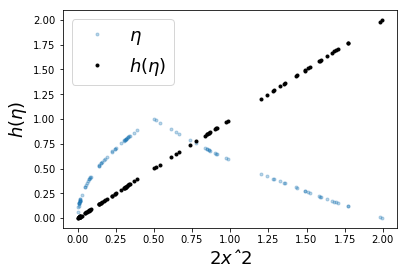

# 2 Probability
<!-- toc orderedList:0 depthFrom:1 depthTo:6 -->

* [2 Probability](#2-probability)
  * [2.1 Introduction](#21-introduction)
    * [2.1.1 Understanding Probability Density](#211-understanding-probability-density)
    * [2.1.2 Random Variables](#212-random-variables)
    * [2.1.3 Continuous Random Variables](#213-continuous-random-variables)
    * [2.1.4 Transformation of Variables Beyond Calculus](#214-transformation-of-variables-beyond-calculus)
    * [2.1.5 Independent Random Variables](#215-independent-random-variables)
    * [2.1.6 Classic Broken Rod Example](#216-classic-broken-rod-example)
  * [2.2 Projection Methods](#22-projection-methods)
    * [2.2.1 Weighted Distance](#221-weighted-distance)
  * [2.3 Conditional Expectation as Projection](#23-conditional-expectation-as-projection)
    * [2.3.1 Appendix](#231-appendix)
  * [2.4 Conditional Expectation and Mean Squared Error](#24-conditional-expectation-and-mean-squared-error)
  * [2.5 Worked Examples of Conditional Expectation# and Mean Square Error Optimization](#25-worked-examples-of-conditional-expectation-and-mean-square-error-optimization)
    * [2.5.1 Example](#251-example)
    * [2.5.2 Example](#252-example)
    * [2.5.3 Example](#253-example)
    * [2.5.4 Example](#254-example)
    * [2.5.5 Example](#255-example)
    * [2.5.6 Example](#256-example)
  * [2.6 Information Entropy](#26-information-entropy)
    * [2.6.1 Information Theory Concepts](#261-information-theory-concepts)
    * [2.6.2 Properties of Information Entropy](#262-properties-of-information-entropy)
    * [2.6.3 Kullback-Leibler Divergence](#263-kullback-leibler-divergence)
  * [2.7 Moment Generating Functions](#27-moment-generating-functions)
  * [2.8 Monte Carlo Sampling Methods](#28-monte-carlo-sampling-methods)
    * [2.8.1 Inverse CDF Method for Discrete Variables](#281-inverse-cdf-method-for-discrete-variables)
    * [2.8.2 Inverse CDF Method for Continuous Variables](#282-inverse-cdf-method-for-continuous-variables)
    * [2.8.3 Rejection Method](#283-rejection-method)
  * [2.9 Useful Inequalities](#29-useful-inequalities)
    * [2.9.1 Markov's Inequality](#291-markovs-inequality)
    * [2.9.2 Chebyshev's Inequality](#292-chebyshevs-inequality)
    * [2.9.3 Hoeffding's Inequality](#293-hoeffdings-inequality)
  * [References](#references)

<!-- tocstop -->


## 2.1 Introduction

### 2.1.1 Understanding Probability Density

### 2.1.2 Random Variables


```python
d = {(i,j):i+j for i in range(1,7) for j in range(1,7)}
d
```


```python
from collections import defaultdict
dinv = defaultdict(list)
for i,j in d.iteritems():
    dinv[j].append(i)
```


```python
X = {i:len(j)/36. for i,j in dinv.iteritems()}
print(X)
```


```python
d={(i,j,k):((i*j*k)/2>i+j+k) for i in range(1,7) for j in range(1,7) for k in range(1,7)}
d
```


```python
dinv = defaultdict(list)
for i,j in d.iteritems():
    dinv[j].append(i)
```


```python
X={i:len(j)/6.0**3 for i,j in dinv.iteritems() }
print(X)
```


```python
from pandas import DataFrame
d = DataFrame(index=[(i,j) for i in range(1,7) for j in range(1,7)],
              columns=['sm','d1','d2','pd1','pd2','p'])
```


```python
d.d1=[i[0] for i in d.index]
d.d2=[i[1] for i in d.index]
```


```python
d.sm=map(sum,d.index)
```


```python
d.head(5) # show first five lines
```


<div>
<table border="1" class="dataframe">
  <thead>
    <tr style="text-align: right;">
      <th></th>
      <th>sm</th>
      <th>d1</th>
      <th>d2</th>
      <th>pd1</th>
      <th>pd2</th>
      <th>p</th>
    </tr>
  </thead>
  <tbody>
    <tr>
      <th>(1, 1)</th>
      <td>&lt;map object at 0x0000005EC1C6AA20&gt;</td>
      <td>1</td>
      <td>1</td>
      <td>NaN</td>
      <td>NaN</td>
      <td>NaN</td>
    </tr>
    <tr>
      <th>(1, 2)</th>
      <td>&lt;map object at 0x0000005EC1C6AA20&gt;</td>
      <td>1</td>
      <td>2</td>
      <td>NaN</td>
      <td>NaN</td>
      <td>NaN</td>
    </tr>
    <tr>
      <th>(1, 3)</th>
      <td>&lt;map object at 0x0000005EC1C6AA20&gt;</td>
      <td>1</td>
      <td>3</td>
      <td>NaN</td>
      <td>NaN</td>
      <td>NaN</td>
    </tr>
    <tr>
      <th>(1, 4)</th>
      <td>&lt;map object at 0x0000005EC1C6AA20&gt;</td>
      <td>1</td>
      <td>4</td>
      <td>NaN</td>
      <td>NaN</td>
      <td>NaN</td>
    </tr>
    <tr>
      <th>(1, 5)</th>
      <td>&lt;map object at 0x0000005EC1C6AA20&gt;</td>
      <td>1</td>
      <td>5</td>
      <td>NaN</td>
      <td>NaN</td>
      <td>NaN</td>
    </tr>
  </tbody>
</table>
</div>


```python
d.loc[d.d1<=3,'pd1']=1/9.
d.loc[d.d1 > 3,'pd1']=2/9.
d.pd2=1/6.
d.head(10)
```


<div>
<table border="1" class="dataframe">
  <thead>
    <tr style="text-align: right;">
      <th></th>
      <th>sm</th>
      <th>d1</th>
      <th>d2</th>
      <th>pd1</th>
      <th>pd2</th>
      <th>p</th>
    </tr>
  </thead>
  <tbody>
    <tr>
      <th>(1, 1)</th>
      <td>&lt;map object at 0x0000005EC1C6AA20&gt;</td>
      <td>1</td>
      <td>1</td>
      <td>0.111111</td>
      <td>0.166667</td>
      <td>NaN</td>
    </tr>
    <tr>
      <th>(1, 2)</th>
      <td>&lt;map object at 0x0000005EC1C6AA20&gt;</td>
      <td>1</td>
      <td>2</td>
      <td>0.111111</td>
      <td>0.166667</td>
      <td>NaN</td>
    </tr>
    <tr>
      <th>(1, 3)</th>
      <td>&lt;map object at 0x0000005EC1C6AA20&gt;</td>
      <td>1</td>
      <td>3</td>
      <td>0.111111</td>
      <td>0.166667</td>
      <td>NaN</td>
    </tr>
    <tr>
      <th>(1, 4)</th>
      <td>&lt;map object at 0x0000005EC1C6AA20&gt;</td>
      <td>1</td>
      <td>4</td>
      <td>0.111111</td>
      <td>0.166667</td>
      <td>NaN</td>
    </tr>
    <tr>
      <th>(1, 5)</th>
      <td>&lt;map object at 0x0000005EC1C6AA20&gt;</td>
      <td>1</td>
      <td>5</td>
      <td>0.111111</td>
      <td>0.166667</td>
      <td>NaN</td>
    </tr>
    <tr>
      <th>(1, 6)</th>
      <td>&lt;map object at 0x0000005EC1C6AA20&gt;</td>
      <td>1</td>
      <td>6</td>
      <td>0.111111</td>
      <td>0.166667</td>
      <td>NaN</td>
    </tr>
    <tr>
      <th>(2, 1)</th>
      <td>&lt;map object at 0x0000005EC1C6AA20&gt;</td>
      <td>2</td>
      <td>1</td>
      <td>0.111111</td>
      <td>0.166667</td>
      <td>NaN</td>
    </tr>
    <tr>
      <th>(2, 2)</th>
      <td>&lt;map object at 0x0000005EC1C6AA20&gt;</td>
      <td>2</td>
      <td>2</td>
      <td>0.111111</td>
      <td>0.166667</td>
      <td>NaN</td>
    </tr>
    <tr>
      <th>(2, 3)</th>
      <td>&lt;map object at 0x0000005EC1C6AA20&gt;</td>
      <td>2</td>
      <td>3</td>
      <td>0.111111</td>
      <td>0.166667</td>
      <td>NaN</td>
    </tr>
    <tr>
      <th>(2, 4)</th>
      <td>&lt;map object at 0x0000005EC1C6AA20&gt;</td>
      <td>2</td>
      <td>4</td>
      <td>0.111111</td>
      <td>0.166667</td>
      <td>NaN</td>
    </tr>
  </tbody>
</table>
</div>


```python
d.p = d.pd1 * d.pd2
d.head(5)
```


<div>
<table border="1" class="dataframe">
  <thead>
    <tr style="text-align: right;">
      <th></th>
      <th>sm</th>
      <th>d1</th>
      <th>d2</th>
      <th>pd1</th>
      <th>pd2</th>
      <th>p</th>
    </tr>
  </thead>
  <tbody>
    <tr>
      <th>(1, 1)</th>
      <td>&lt;map object at 0x0000005EC1C6AA20&gt;</td>
      <td>1</td>
      <td>1</td>
      <td>0.111111</td>
      <td>0.166667</td>
      <td>0.0185185</td>
    </tr>
    <tr>
      <th>(1, 2)</th>
      <td>&lt;map object at 0x0000005EC1C6AA20&gt;</td>
      <td>1</td>
      <td>2</td>
      <td>0.111111</td>
      <td>0.166667</td>
      <td>0.0185185</td>
    </tr>
    <tr>
      <th>(1, 3)</th>
      <td>&lt;map object at 0x0000005EC1C6AA20&gt;</td>
      <td>1</td>
      <td>3</td>
      <td>0.111111</td>
      <td>0.166667</td>
      <td>0.0185185</td>
    </tr>
    <tr>
      <th>(1, 4)</th>
      <td>&lt;map object at 0x0000005EC1C6AA20&gt;</td>
      <td>1</td>
      <td>4</td>
      <td>0.111111</td>
      <td>0.166667</td>
      <td>0.0185185</td>
    </tr>
    <tr>
      <th>(1, 5)</th>
      <td>&lt;map object at 0x0000005EC1C6AA20&gt;</td>
      <td>1</td>
      <td>5</td>
      <td>0.111111</td>
      <td>0.166667</td>
      <td>0.0185185</td>
    </tr>
  </tbody>
</table>
</div>


```python
d.groupby('sm')['p'].sum()
```


    sm
    <map object at 0x0000005EC1C6AA20>    1.0
    Name: p, dtype: float64


### 2.1.3 Continuous Random Variables

### 2.1.4 Transformation of Variables Beyond Calculus

### 2.1.5 Independent Random Variables

### 2.1.6 Classic Broken Rod Example


```python
import numpy as np
x,y = np.random.rand(2,1000) # uniform rv
a,b,c = x,(y-x),1-y # 3 sides
s = (a+b+c)/2
np.mean((s>a) & (s>b) & (s>c) & (y>x)) # approx 1/8=0.125
```


    0.113


## 2.2 Projection Methods


```python
from sympy.abc import y,x
from sympy import integrate, simplify
fxy = x + y # joint density
fy = integrate(fxy,(x,0,1)) # marginal density
fx = integrate(fxy,(y,0,1)) # marginal density
EXY = (3*y+2)/(6*y+3) # conditional expectation
```


```python
# from the definition
LHS=integrate((x-EXY)**2*fxy,(x,0,1),(y,0,1))
LHS # left-hand-side
```


    -log(3)/144 + 1/12


```python
# using Pythagorean theorem
RHS=integrate((x)**2*fx,(x,0,1))-integrate((EXY)**2*fy,(y,0,1))
RHS # right-hand-side
```


    -log(3)/144 + 1/12


```python
print simplify(LHS-RHS)==0
```


      File "<ipython-input-34-f9bcab6c6bb1>", line 1
        print simplify(LHS-RHS)==0
                     ^
    SyntaxError: invalid syntax


### 2.2.1 Weighted Distance

## 2.3 Conditional Expectation as Projection

### 2.3.1 Appendix

## 2.4 Conditional Expectation and Mean Squared Error


```python
import sympy as S
from sympy.stats import density, E, Die
x=Die('D1',6) # 1st six sided die
y=Die('D2',6) # 2nd six sides die
a=S.symbols('a')
z = x+y # sum of 1st and 2nd die
J = E((x-a*(x+y))**2) # expectation
print(S.simplify(J))
```

    329*a**2/6 - 329*a/6 + 91/6


```python
sol,=S.solve(S.diff(J,a),a) # using calculus to minimize
print(sol) # solution is 1/2
```

    1/2


```python
import numpy as np
from sympy import stats
# Eq constrains Z
samples_z7 = lambda : stats.sample(x, S.Eq(z,7))
#using 6 as an estimate
mn= np.mean([(6-samples_z7())**2 for i in range(100)])
#7/2 is the MSE estimate
mn0= np.mean([(7/2.-samples_z7())**2 for i in range(100)])
print('MSE=%3.2f using 6 vs MSE=%3.2f using 7/2 ' % (mn,mn0))
```

    MSE=9.33 using 6 vs MSE=3.13 using 7/2


```python
# here 6 is ten times more probable than any other outcome
x=stats.FiniteRV('D3',{1:1/15.,
                       2:1/15.,3:1/15.,
                       4:1/15.,5:1/15.,
                       6:2/3.})
```


```python
E(x, S.Eq(z,7)) # conditional expectation E(x|z=7)
samples_z7 = lambda : stats.sample(x, S.Eq(z,7))
#using 6 as an estimate
mn= np.mean([(6-samples_z7())**2 for i in range(100)])
#5 is the MSE estimate
mn0= np.mean([(5-samples_z7())**2 for i in range(100)])
print('MSE=%3.2f using 6 vs MSE=%3.2f using 5 ' % (mn,mn0))
```

    MSE=3.61 using 6 vs MSE=2.55 using 5


## 2.5 Worked Examples of Conditional Expectation# and Mean Square Error Optimization


```python

```

### 2.5.1 Example


```python
import sympy as S
X10,X20,X50 = S.symbols('X10,X20,X50',real=True)
xi = 10*X10+20*X20+50*X50
eta = X10*X20*(1-X50)+X10*(1-X20)*(X50)+(1-X10)*X20*(X50)
num=S.summation(xi*eta,(X10,0,1),(X20,0,1),(X50,0,1))
den=S.summation(eta*eta,(X10,0,1),(X20,0,1),(X50,0,1))
alpha=num/den
print(alpha) # alpha=160/3
```

    160/3


```python
import pandas as pd
d = pd.DataFrame(columns=['X10','X20','X50'])
d.X10 = np.random.randint(0,2,1000)
d.X10 = np.random.randint(0,2,1000)
d.X20 = np.random.randint(0,2,1000)
d.X50 = np.random.randint(0,2,1000)
```


```python
grp=d.groupby(d.eval('X10+X20+X50'))
```


```python
grp.get_group(2).eval('10*X10+20*X20+50*X50').mean()
```


    53.395225464190979


```python
import numpy as np
from numpy import array
x=np.random.randint(0,2,(3,1000))
print(np.dot(x[:,x.sum(axis=0)==2].T,array([10,20,50])).mean())
```

    53.9733333333


```python
import itertools as it
list(it.product((0,1),(0,1),(0,1)))
```


    [(0, 0, 0),
     (0, 0, 1),
     (0, 1, 0),
     (0, 1, 1),
     (1, 0, 0),
     (1, 0, 1),
     (1, 1, 0),
     (1, 1, 1)]


```python
list(it.ifilter(lambda i:sum(i)==2,it.product((0,1),(0,1),(0,1))))
```


```python
map(lambda k:10*k[0]+20*k[1]+50*k[2],
    it.ifilter(lambda i:sum(i)==2,
               it.product((0,1),(0,1),(0,1))))
```

### 2.5.2 Example


```python
from sympy.abc import a,b
h = a*eta + b
eta = X10*X20*30 + X10*(1-X20)*(10)+ (1-X10)*X20*(20)
MSE=S.summation((xi-h)**2*S.Rational(1,8),(X10,0,1),
                (X20,0,1),
                (X50,0,1))
sol=S.solve([S.diff(MSE,a),S.diff(MSE,b)],(a,b))
print(sol)
```

    {a: 64/3, b: 32}


```python
expr = expr=S.expand((xi-h)*eta)
print(expr)
expr.xreplace({X10**2:0.5, X20**2:0.5,X10:0.5,X20:0.5,X50:0.5})
```

    30*X10**2*X20*X50*a - 10*X10**2*X20*a - 10*X10**2*X50*a + 100*X10**2 + 60*X10*X20**2*X50*a - 20*X10*X20**2*a - 30*X10*X20*X50*a + 400*X10*X20 + 500*X10*X50 - 10*X10*b - 20*X20**2*X50*a + 400*X20**2 + 1000*X20*X50 - 20*X20*b


    -7.5*a - 15.0*b + 725.0


```python
print(S.expand((xi-h)*1).xreplace({X10**2:0.5,
                                   X20**2:0.5,
                                   X10:0.5,
                                   X20:0.5,
                                   X50:0.5}))
```

    -0.375*a - b + 40.0


```python
print(S.solve([-350.0*a-15.0*b+725.0,-15.0*a-b+40.0]))
```

    {a: 1.00000000000000, b: 25.0000000000000}


```python
d['sm'] = d.eval('X10*10+X20*20')
d.groupby('sm').mean()
```


<div>
<table border="1" class="dataframe">
  <thead>
    <tr style="text-align: right;">
      <th></th>
      <th>X10</th>
      <th>X20</th>
      <th>X50</th>
    </tr>
    <tr>
      <th>sm</th>
      <th></th>
      <th></th>
      <th></th>
    </tr>
  </thead>
  <tbody>
    <tr>
      <th>0</th>
      <td>0.0</td>
      <td>0.0</td>
      <td>0.465649</td>
    </tr>
    <tr>
      <th>10</th>
      <td>1.0</td>
      <td>0.0</td>
      <td>0.490272</td>
    </tr>
    <tr>
      <th>20</th>
      <td>0.0</td>
      <td>1.0</td>
      <td>0.508065</td>
    </tr>
    <tr>
      <th>30</th>
      <td>1.0</td>
      <td>1.0</td>
      <td>0.463519</td>
    </tr>
  </tbody>
</table>
</div>


```python
d.groupby('sm').mean().eval('10*X10+20*X20+50*X50')
```


    sm
    0     23.282443
    10    34.513619
    20    45.403226
    30    53.175966
    dtype: float64


### 2.5.3 Example


```python
x,c,b,a=S.symbols('x,c,b,a')
xi = 2*x**2

eta=S.Piecewise((1,S.And(S.Gt(x,0),
                         S.Lt(x,S.Rational(1,3)))), # 0 < x < 1/3
                (2,S.And(S.Gt(x,S.Rational(1,3)),
                         S.Lt(x,S.Rational(2,3)))), # 1/3 < x < 2/3,
                (0,S.And(S.Gt(x,S.Rational(2,3)),
                         S.Lt(x,1)))) # 1/3 < x < 2/3
h = a + b*eta + c*eta**2
J=S.integrate((xi-h)**2,(x,0,1))
sol=S.solve([S.diff(J,a),
             S.diff(J,b),
             S.diff(J,c),
            ],
            (a,b,c))
```


```python
print(sol)
```

    {a: 38/27, b: -20/9, c: 8/9}


```python
print(S.piecewise_fold(h.subs(sol)))
```

    Piecewise((2/27, And(x < 1/3, x > 0)), (14/27, And(x < 2/3, x > 1/3)), (38/27, And(x < 1, x > 2/3)))


```python
x,a,b,c,eta = S.symbols('x,a,b,c,eta',real=True)
xi = 2*x**2
eta=S.Piecewise((1,S.And(S.Gt(x,0),
                         S.Lt(x,S.Rational(1,3)))), # 0 < x < 1/3
                (2,S.And(S.Gt(x,S.Rational(1,3)),
                         S.Lt(x,S.Rational(2,3)))), # 1/3 < x < 2/3,
                (0,S.And(S.Gt(x,S.Rational(2,3)),
                         S.Lt(x,1)))) # 1/3 < x < 2/3
h = c+b*eta+a*eta**2
```


```python
S.integrate((xi-h)*1,(x,0,1))
```


    -5*a/3 - b - c + 2/3


```python
S.integrate((xi-h)*eta,(x,0,1))
```


    -3*a - 5*b/3 - c + 10/27


```python
S.integrate((xi-h)*eta**2,(x,0,1))
```


    -17*a/3 - 3*b - 5*c/3 + 58/81


```python
eqs=[ -5*a/3 - b - c + 2/3,
     -3*a - 5*b/3 - c + 10/27,
     -17*a/3 - 3*b - 5*c/3 + 58/81]
```


```python
sol=S.solve(eqs)
print(sol)
print(S.piecewise_fold(h.subs(sol)))
```

    {a: 0.888888888888889, b: -2.22222222222222, c: 1.40740740740741}
    Piecewise((0.0740740740740740, And(x < 1/3, x > 0)), (0.518518518518518, And(x < 2/3, x > 1/3)), (1.40740740740741, And(x < 1, x > 2/3)))


```python
d = pd.DataFrame(columns=['x','eta','xi'])
d.x = np.random.rand(1000)
d.xi = 2*d.x**2
pd.cut(d.x,[0,1/3,2/3,1]).head()
```


    0        (0, 0.333]
    1        (0, 0.333]
    2        (0, 0.333]
    3        (0.667, 1]
    4    (0.333, 0.667]
    Name: x, dtype: category
    Categories (3, object): [(0, 0.333] < (0.333, 0.667] < (0.667, 1]]


```python
d.groupby(pd.cut(d.x,[0,1/3,2/3,1])).mean()['xi']
```


    x
    (0, 0.333]        0.068886
    (0.333, 0.667]    0.525851
    (0.667, 1]        1.425069
    Name: xi, dtype: float64


```python
from sympy.stats import E, Uniform
x=Uniform('x',0,1)
E(2*x**2,S.And(x < S.Rational(1,3), x > 0))
```


    2/27


```python
E(2*x**2,S.And(x < S.Rational(2,3), x > S.Rational(1,3)))
```


    14/27


```python
E(2*x**2,S.And(x < 1, x > S.Rational(2,3)))
```


    38/27


### 2.5.4 Example

### 2.5.5 Example


```python
from pandas import DataFrame
import numpy as np
d = DataFrame(columns=['xi','eta','x','h','h1','h2'])
# 100 random samples
```


```python
d.x = np.random.rand(100)
d.xi = d.eval('2*x**2')
d.eta =1-abs(2*d.x-1)
d.h1=d[(d.x<0.5)].eval('eta**2/2')
d.h2=d[(d.x>=0.5)].eval('(2-eta)**2/2')
d.fillna(0,inplace=True)
d.h = d.h1+d.h2
d.head()
```


<div>
<table border="1" class="dataframe">
  <thead>
    <tr style="text-align: right;">
      <th></th>
      <th>xi</th>
      <th>eta</th>
      <th>x</th>
      <th>h</th>
      <th>h1</th>
      <th>h2</th>
    </tr>
  </thead>
  <tbody>
    <tr>
      <th>0</th>
      <td>0.308479</td>
      <td>0.785467</td>
      <td>0.392734</td>
      <td>0.308479</td>
      <td>0.308479</td>
      <td>0.000000</td>
    </tr>
    <tr>
      <th>1</th>
      <td>0.318254</td>
      <td>0.797814</td>
      <td>0.398907</td>
      <td>0.318254</td>
      <td>0.318254</td>
      <td>0.000000</td>
    </tr>
    <tr>
      <th>2</th>
      <td>0.156723</td>
      <td>0.559862</td>
      <td>0.279931</td>
      <td>0.156723</td>
      <td>0.156723</td>
      <td>0.000000</td>
    </tr>
    <tr>
      <th>3</th>
      <td>0.643968</td>
      <td>0.865127</td>
      <td>0.567436</td>
      <td>0.643968</td>
      <td>0.000000</td>
      <td>0.643968</td>
    </tr>
    <tr>
      <th>4</th>
      <td>0.015170</td>
      <td>0.174182</td>
      <td>0.087091</td>
      <td>0.015170</td>
      <td>0.015170</td>
      <td>0.000000</td>
    </tr>
  </tbody>
</table>
</div>


```python
import matplotlib.pylab as plt
from matplotlib.pyplot import subplots
fig,ax=subplots()
ax.plot(d.xi,d.eta,'.',alpha=.3,label='$\eta$')
ax.plot(d.xi,d.h,'k.',label='$h(\eta)$')
ax.legend(loc=0,fontsize=18)
ax.set_xlabel('$2 xˆ2$',fontsize=18)
ax.set_ylabel('$h(\eta)$',fontsize=18)
plt.show()
```





### 2.5.6 Example

## 2.6 Information Entropy

### 2.6.1 Information Theory Concepts

### 2.6.2 Properties of Information Entropy

### 2.6.3 Kullback-Leibler Divergence

## 2.7 Moment Generating Functions


```python
import sympy as S
from sympy import stats
p,t = S.symbols('p t',positive=True)
x=stats.Binomial('x',10,p)
mgf = stats.E(S.exp(t*x))
print(S.simplify(stats.E(x)))
print(S.simplify(S.diff(mgf,t).subs(t,0)))
print(S.simplify(stats.moment(x,1))) # mean)
print(S.simplify(stats.moment(x,2))) # 2nd moment
```

    10*p
    10*p
    10*p
    10*p*(9*p + 1)


```python
S.var('x:2',real=True)
S.var('mu:2',real=True)
S.var('sigma:2',positive=True)
S.var('t',positive=True)
x0 = stats.Normal(x0,mu0,sigma0)
x1 = stats.Normal(x1,mu1,sigma1)
mgf0 = S.simplify(stats.E(S.exp(t*x0)))
mgf1 = S.simplify(stats.E(S.exp(t*x1)))
mgfY = S.simplify(mgf0*mgf1)
S.collect(S.expand(S.log(mgfY)),t)
```


    t**2*(sigma0**2/2 + sigma1**2/2) + t*(mu0 + mu1)


## 2.8 Monte Carlo Sampling Methods

### 2.8.1 Inverse CDF Method for Discrete Variables


```python
import pandas as pd
import numpy as np
from pandas import DataFrame
u= np.random.rand(100)
df = DataFrame(data=u,columns=['u'])
labels = [1,2,3,4,5,6]

df['v']=pd.cut(df.u,np.linspace(0,1,7),
               include_lowest=True,labels=labels)
```


```python
df.head()
```


<div>
<table border="1" class="dataframe">
  <thead>
    <tr style="text-align: right;">
      <th></th>
      <th>u</th>
      <th>v</th>
    </tr>
  </thead>
  <tbody>
    <tr>
      <th>0</th>
      <td>0.718461</td>
      <td>5</td>
    </tr>
    <tr>
      <th>1</th>
      <td>0.839452</td>
      <td>6</td>
    </tr>
    <tr>
      <th>2</th>
      <td>0.908277</td>
      <td>6</td>
    </tr>
    <tr>
      <th>3</th>
      <td>0.351629</td>
      <td>3</td>
    </tr>
    <tr>
      <th>4</th>
      <td>0.885413</td>
      <td>6</td>
    </tr>
  </tbody>
</table>
</div>


```python
df.groupby('v').count()
```


<div>
<table border="1" class="dataframe">
  <thead>
    <tr style="text-align: right;">
      <th></th>
      <th>u</th>
    </tr>
    <tr>
      <th>v</th>
      <th></th>
    </tr>
  </thead>
  <tbody>
    <tr>
      <th>1</th>
      <td>16</td>
    </tr>
    <tr>
      <th>2</th>
      <td>17</td>
    </tr>
    <tr>
      <th>3</th>
      <td>14</td>
    </tr>
    <tr>
      <th>4</th>
      <td>12</td>
    </tr>
    <tr>
      <th>5</th>
      <td>25</td>
    </tr>
    <tr>
      <th>6</th>
      <td>16</td>
    </tr>
  </tbody>
</table>
</div>


```python
df['v']=pd.cut(df.u,[0,1/12,2/12,3/12,2/4,3/4,1],
               include_lowest=True,labels=labels)
```


```python
df.groupby('v').count()/df.shape[0]
```


<div>
<table border="1" class="dataframe">
  <thead>
    <tr style="text-align: right;">
      <th></th>
      <th>u</th>
    </tr>
    <tr>
      <th>v</th>
      <th></th>
    </tr>
  </thead>
  <tbody>
    <tr>
      <th>1</th>
      <td>0.08</td>
    </tr>
    <tr>
      <th>2</th>
      <td>0.08</td>
    </tr>
    <tr>
      <th>3</th>
      <td>0.06</td>
    </tr>
    <tr>
      <th>4</th>
      <td>0.25</td>
    </tr>
    <tr>
      <th>5</th>
      <td>0.26</td>
    </tr>
    <tr>
      <th>6</th>
      <td>0.27</td>
    </tr>
  </tbody>
</table>
</div>


### 2.8.2 Inverse CDF Method for Continuous Variables


```python
from numpy import array, log
import scipy.stats
alpha = 1. # distribution parameter
nsamp = 1000 # num of samples
# define uniform random variable
u=scipy.stats.uniform(0,1)
# define inverse function
Finv=lambda u: 1/alpha*log(1/(1-u))
# apply inverse function to samples
v = array(map(Finv,u.rvs(nsamp)))
```


```python
fig,ax=subplots()
scipy.stats.probplot(v,(1,),dist='expon',plot=ax)
```

### 2.8.3 Rejection Method


```python
import numpy as np
x = np.linspace(0.001,15,100)
f= lambda x: np.exp(-(x-1)**2/2./x)*(x+1)/12.
fx = f(x)
M=0.3 # scale factor
u1 = np.random.rand(10000)*15 # uniform random samples scaled out
u2 = np.random.rand(10000) # uniform random samples
idx,= np.where(u2<=f(u1)/M) # rejection criterion
v = u1[idx]
```


```python
ch=scipy.stats.chi2(4) # chi-squared
h = lambda x: f(x)/ch.pdf(x) # h-function
hmax=h(x).max()
u1 = ch.rvs(5000) # samples from chi-square distribution
u2 = np.random.rand(5000)# uniform random samples
idx = (u2 <= h(u1)/hmax) # rejection criterion
v = u1[idx] # keep these only
```

## 2.9 Useful Inequalities

### 2.9.1 Markov's Inequality

### 2.9.2 Chebyshev's Inequality


```python
import sympy
import sympy.stats as ss
t=sympy.symbols('t',real=True)
x=ss.ChiSquared('x',1)
```


```python
r = ss.P((x-1) > t,x>1)+ss.P(-(x-1) > t,x<1)
```


```python
w=(1-ss.cdf(x)(t+1))+ss.cdf(x)(1-t)
```


```python
fw=sympy.lambdify(t,w)
```


```python
map(fw,[0,1,2,3,4])
```


    <map at 0x5ec7f18898>


### 2.9.3 Hoeffding's Inequality


```python

```

## References


```python

```
