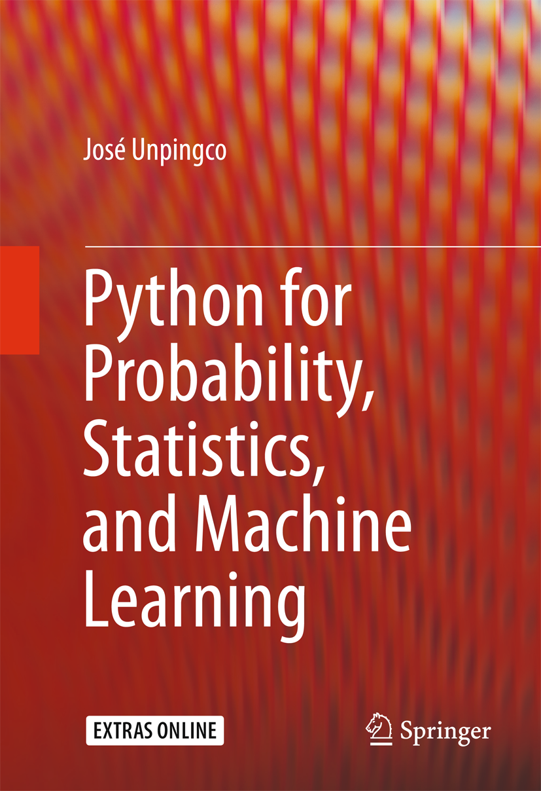

# Python for Probability Statistics and Machine Learning

* [Publisher](https://link.springer.com/book/10.1007%2F978-3-319-30717-6)

## TOC
* [Ch1 Getting Started with Scientific Python](Ch1_Getting_Started_with_Scientific_Python.md)
* [Ch2 Probability](Ch2_Probability.md)
* [Ch3 Statistics](Ch3_Statistics.md)
* [Ch4 Machine Learning](Ch4_Machine_Learning.md)